# Is it feasible to develop a 3D game in 2 hours with AI tools

**Try it online:** [http://learncocos.com/aigcsnake](http://learncocos.com/aigcsnake/)

the FULL SOURCE CODE will be available on Cocos Store.

I scored 21, could anyone get a higher than mine?！！！

Recently, Technological advancements are changing rapidly by AI, especially by ChatGPT.

Just as we thought that Stable Diffusion and Mid Journey only threatened the artists, we were still glad that programmers were unlikely to be replaced.

The release of GPT-4 in March has made me (a programmer) feel a sense of crisis!!..

Many developers say that they can just become a **UI Assembler** and let GPT-4 write shaders for them. I am both skeptical and anxious about this.

Starting from practice, this article explores the upper and lower limits of AI.

All aspects of the project, including programming, shader development, art, and music, are generated by AIGC.

I am responsible for resource assembly as a **UI Assembler**, with the goal of exploring the potential of AI and alleviating concerns or anxieties.

## Preface

Habitually, let's start with a mind map to determine what to include. The game will be a 3D Snake, with innovative gameplay and a complex terrain.

Why I write a mind map first? Because there are many functional points, and the mind map can assist me in functional decomposition to avoid mutual interference. It also helps improve ChatGPT 4's understanding of the project.
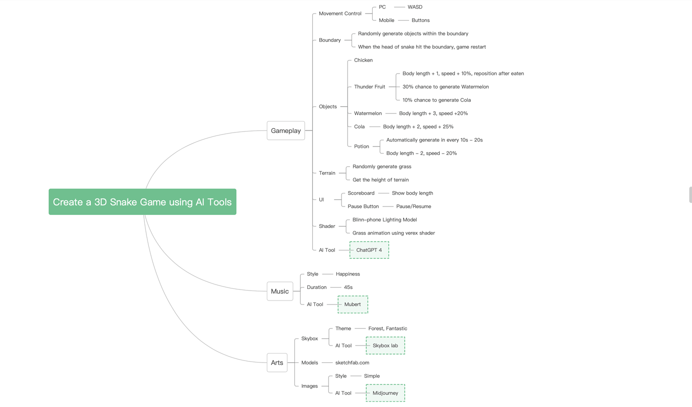

## Gameplay Coding

First communication

Since the data for ChatGPT4 only goes up to 2021, it can only recognize the API for Cocos Creator version 3.3. For this project, I'm using the latest version, 3.7.2. I communicated my first requirement to it and surprisingly, it didn't throw an error!

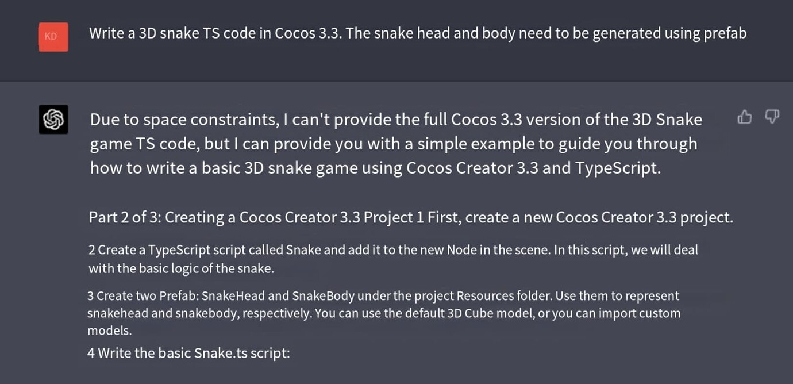

Then it crashed when I ran the program! It directly reported an error during initialization. After checking, I found that the var `_moveDirection` for snake direction was null (guess why it didn't run?).

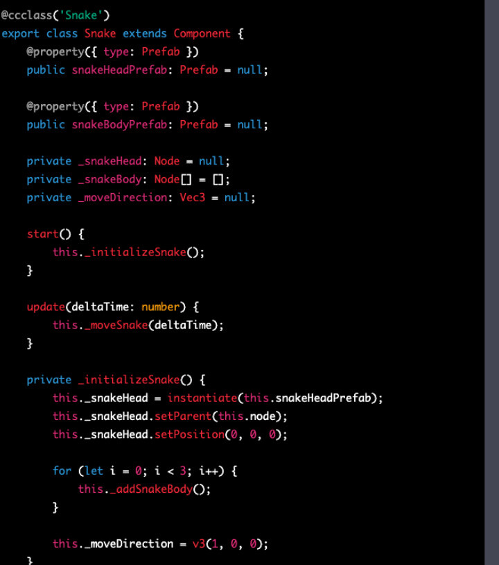

After communication, ChatGPT quickly fixed the issue.

Everything is OK!

However, when the logic of the snake eating fruit was added and the program was run again, it was discovered that the direction of the snake was incorrect. As an experienced UI Assembler, I quickly realized that the coordinates of the snake's head had been corrupted. At this point, I was starting to feel a bit discouraged. Will I need to modify the code it generates every time before I can use it?

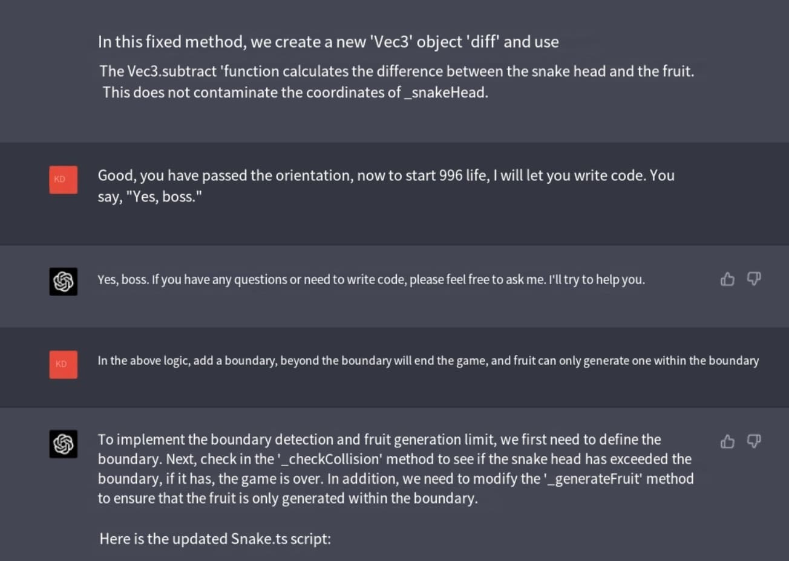

So I started communicating frantically with ChatGPT, and everything went smoothly in the development of the next 5 features.

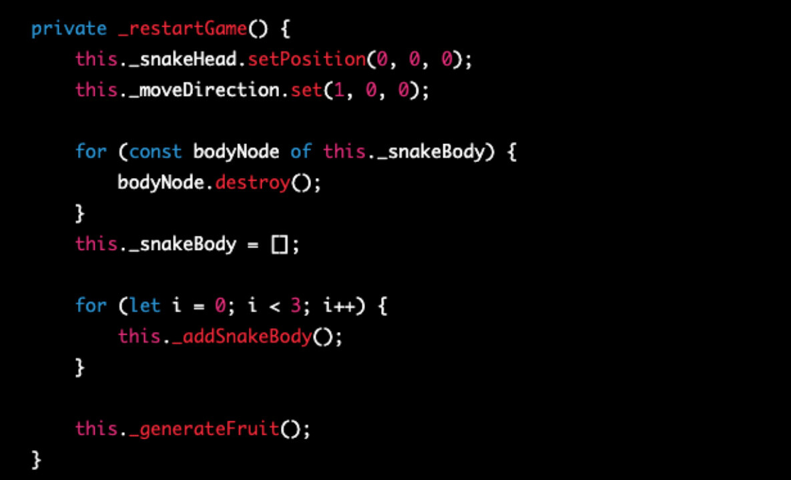

ChatGPT and I were also gradually getting better at working together.

With ChatGPT's help, it took me about 50 minutes to finish writing all of the game logic, and everything was working properly.

## Brief Summary for Gameplay Code

Finally, I had ChatGPT make a simple summary.

**ChatGPT**: In this conversation, we worked together to create a basic 3D snake game. You raised some questions and requests, and I made modifications and additions to the code. The following are the modifications and additions you requested:

1. Add logic to use the keyboard WASD to control the movement of the snake.

2. Fix the issue of _moveDirection not having an initial value.

3. Add logic for the snake's body to grow after eating fruit, and for the fruit to appear randomly on the map.

4. Modify the issue of using `this._snakeHead.position.subtract` in the _checkCollision method.

5. Add logic for the game boundary, and the game will restart if the snake goes beyond the boundary.

6. Add a chicken to the map, and restart the game if the snake collides with the chicken.

7. When the snake collides with the fruit, the position of the chicken will randomly change.

8. There is a 30% chance of generating a big watermelon after eating fruit, and eating the big watermelon will increase the snake's length by 3.

9. There is a 10% chance of generating a Thunder Fruit after eating fruit, and eating the Thunder Fruit will increase the snake's speed by 20% and length by 2.

10. Provide a randomRange method.

11. Add logic for generating a Slow Fruit randomly on the map every 10-20 seconds. Eating the Slow Fruit will decrease the snake's speed by 20% and decrease its body length by 1.

12. Optimize the logic for generating special fruits by checking if the previous node exists. If it exists, then reposition the special fruit instead of generating a new one.

13. Add four buttons for up, down, left, and right directions. Pressing the buttons will control the snake's movement.

14. Hide the direction control buttons when running on a computer and display them when running on a mobile device.

15. Use touch-down method to control the buttons.

16. Add a label scoreboard to display the length of the snake body. The scoreboard will update every time the length of the snake changes (increases or decreases).

17. Add a "Pause" button that toggles between pausing and resuming the game when clicked.

18. Outputting the full code again with both Chinese and English comments.

19. Add logic for camera to follow the movement of the snake's head.

20. Fix the issue in the camera control logic where the snake head node was not being properly retrieved.

21. Add damping to the camera to make the camera follow more smoothly.

22. Throughout the process, you paid attention to many details and made suggestions for improvement. This helps us to refine the functionality and experience of the game together.

## Terrain

**The terrain part is quite challenging, so a new chat has been started for it.**

Here, we need ChatGPT to generate code for randomly placing plants on the terrain. It runs without any issues, but the generated positions are noticeably biased towards one side.

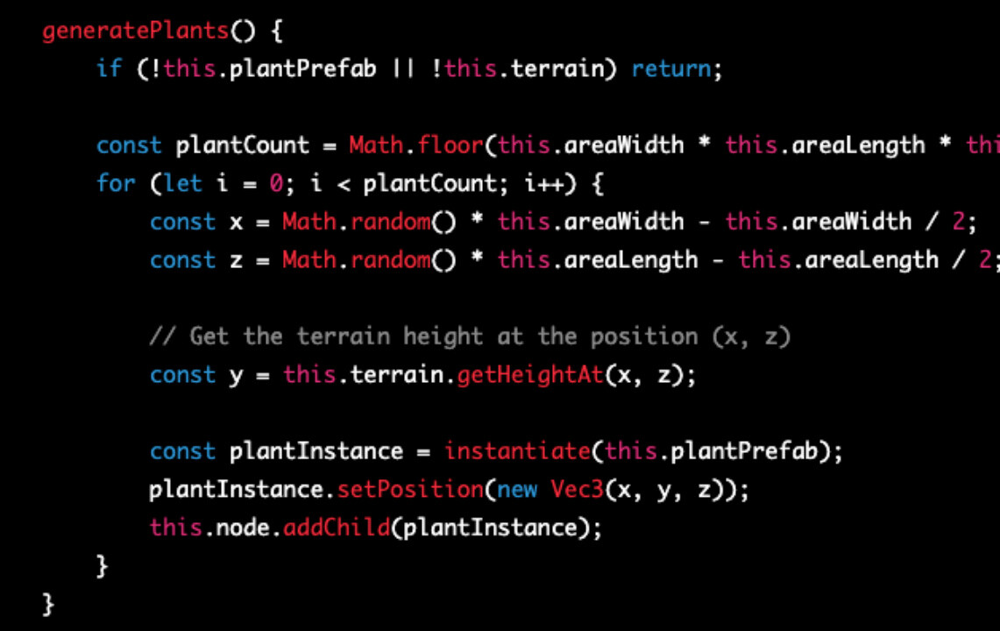
  
Continuously remind ChatGPT.

Rapidly fix it.

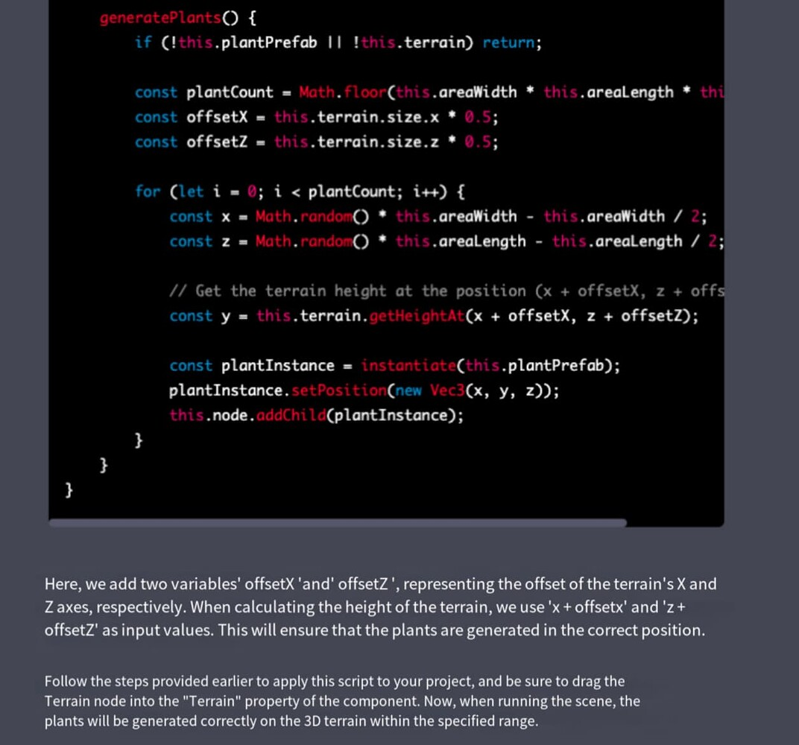

Bring up this written method again and communicate it with the previous conversation.

Add the logic for the snake head and the generating objects, and everything is going smoothly!

The program part is completed like this. It was thrilling but ultimately successful!

The programming part has been completed with some close calls.

**2.0 Shader**

Now we have reached the Shader part, and because there are significant differences between the Cocos Creator 3.3 and 3.7 versions, we have encountered several problems.

Let's start with the simplest one, Blinn-Phong.

I couldn't take it anymore after only finishing half of the Vertex Shader.

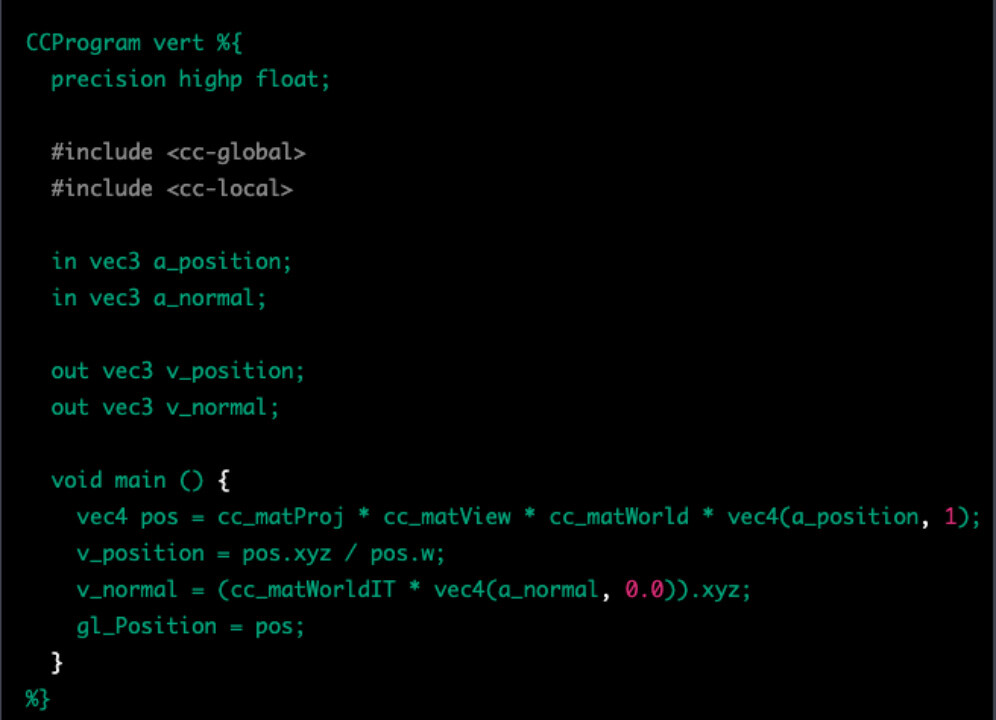

This was too old to be used in 3.7

After repeated modifications, we finally solved the Vertex Shader problem.

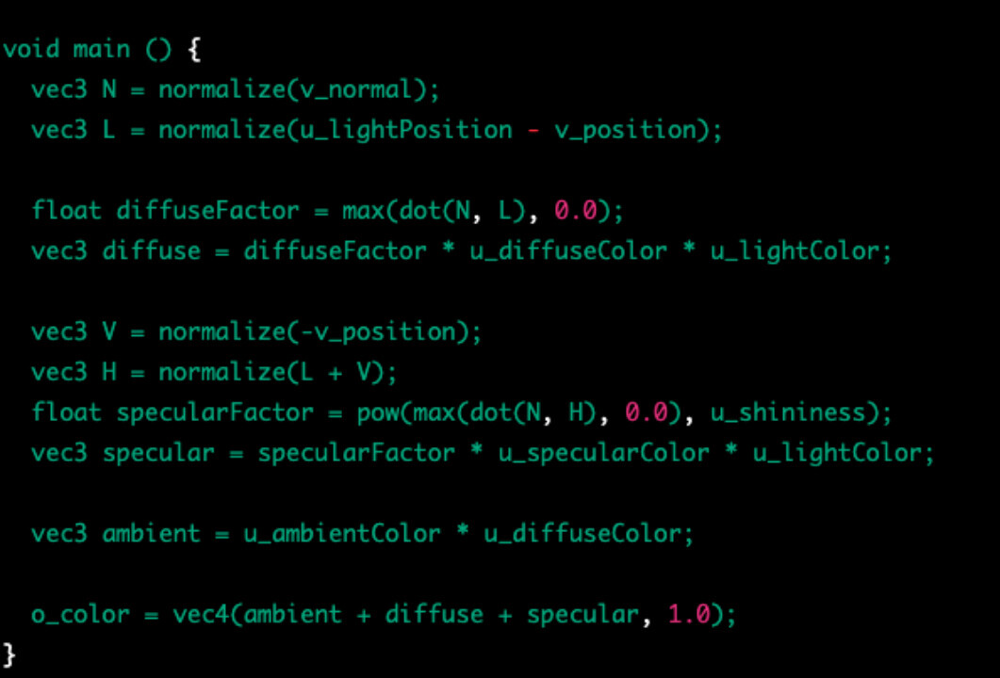

Leaving aside API issues, the Fragment Shader part alone did not consider the viewing position of the camera in this lighting model.

Then we encountered various issues with vector calculations, API, and global variable problems.

After an hour of struggling (including changing chat twice, which was quite convoluted), we finally managed to run it on 3.7.2. It is suggested that everyone should primarily refer to this for now.

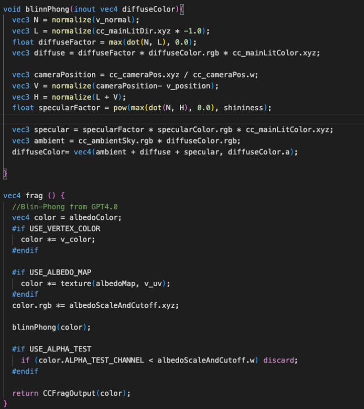

## Grass Animation

Next, we will write an effect of grass swaying in the wind, which is also a common effect. Fortunately, I was mentally prepared for the possibility of poor results, and as expected, ChatGPT4 forgot to include the necessary chunk.

To save face, ChatGPT quickly went to Github and copied one.

But when I ran it, there were still problems!

We changed the effect processing to before the projection transformation, and now we can see the grass swaying in the wind.

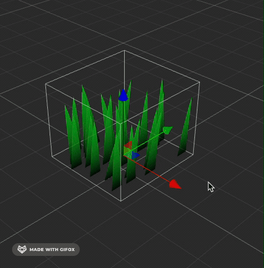

Finally, we enabled GPU INSTANCING to reduce draw calls and ensure performance!

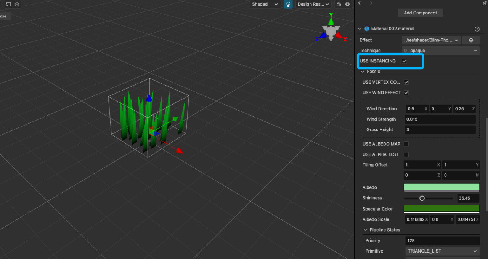

**3.0 Music**

https://mubert.com/

Using mubert.com to generate music and calling the engine's AudioSource component.
Prompts: fun happy snake

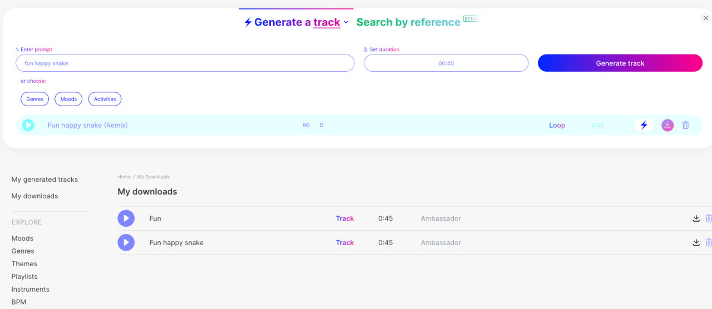

**4.0 Skybox**
https://skybox.blockadelabs.com/

it is also generated using blockadelabs.

Prompts:Fantasy, Forest, Lake

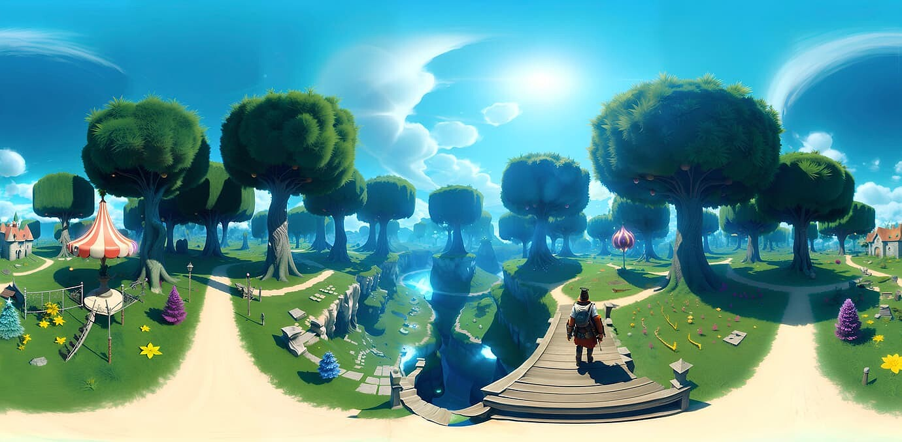

**5.0 Images**

https://www.midjourney.com/
This is too important and widely used, and I won't go into details here.

Prompts: Simple Arrow Pause Button

**Icons**

Prompts: snake eating an apple, cyberpunk , in the space, hyper-realistic, surreal, fantasy, cinematic, extremely detail, 3D, manipulation, VFX, dark background, cool --q 2 --v 5 -

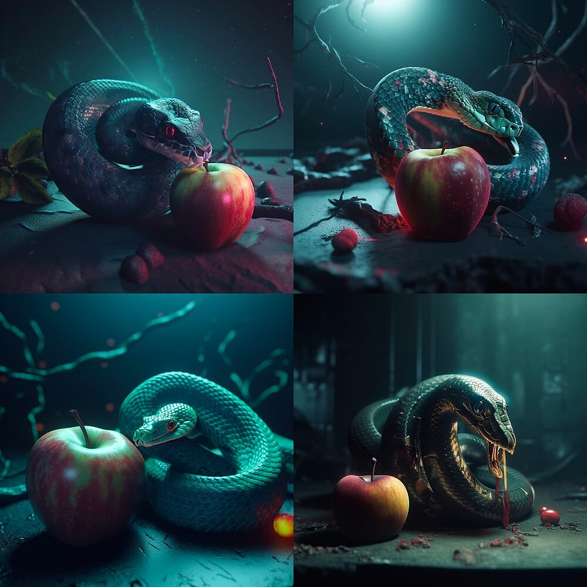

_a_logo_with_AIGC_Snake_clean_backgroundcyberpunk_style

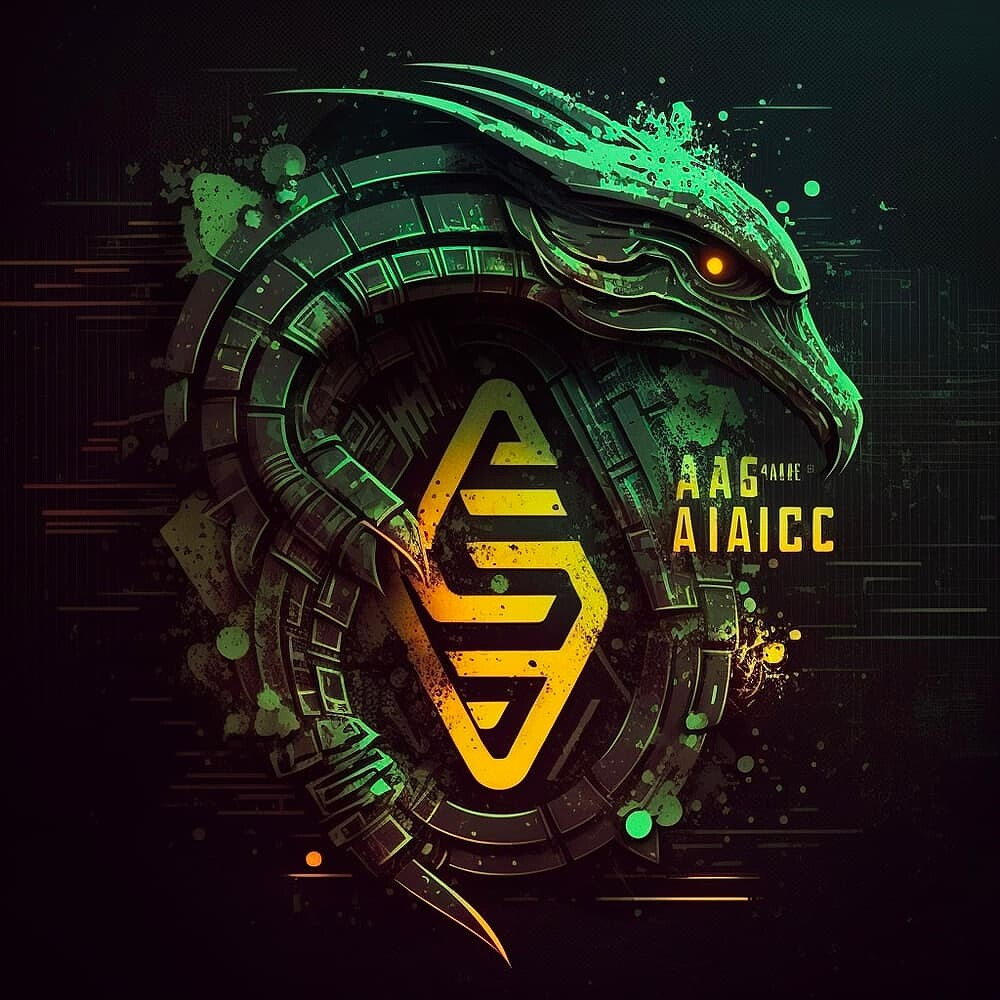

**Loading Picture**

Prompts:cute snake eating an apple, cyberpunk , in the space, hyper-realistic, surreal, fantasy, cinematic, extremely detail, 3D, manipulation, VFX, dark background, cool --q 2 --v 5 --ar 16:9

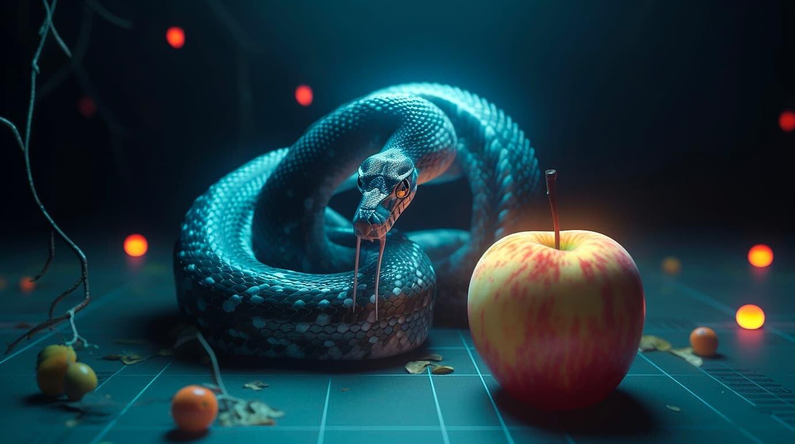

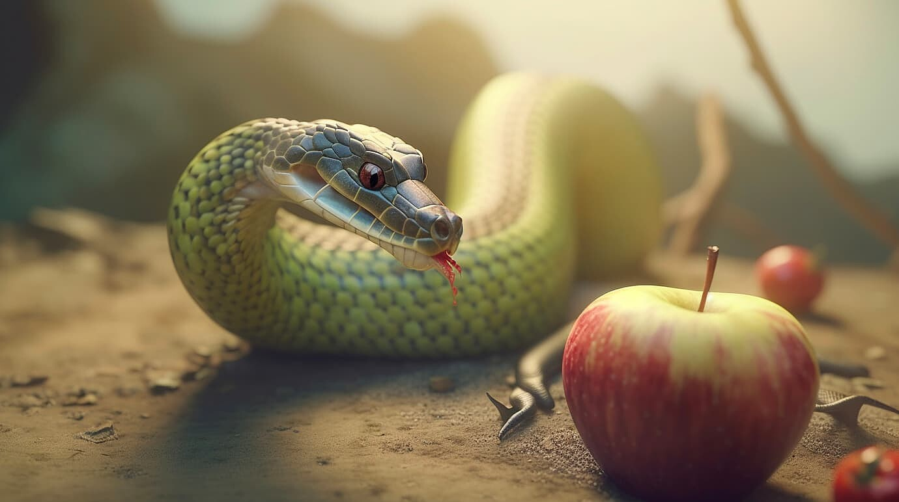

**Last but not least** **：**

At present, the GPT database is relatively old ( only to 2021), and we encountered many problems with shaders. However, in any case, it's still satisfying to be able to finish a small game within two hours.

The most critical thing is that you don't need to use your brain much, just let the AI do the work.

## Summary

1. Limit the number of prompts to 2-3 each time for easier feedback and troubleshooting. For example, if all requirements are communicated at once and an error occurs, it may be difficult for both the AI and myself to point out the issue.
2. Clear version and language information is necessary, such as using Cocos Creator 3.3 (known to be the latest version for GPT-4 in 2021) and avoiding the use of older APIs. The language requirement should be TypeScript (otherwise, it may inadvertently copy the JS version). For shaders, it is recommended to refer to WebGL and use Yaml syntax.
3. When reporting issues, provide as much detailed feedback as possible so that the AI can learn from the problem.
4. Try to communicate a major requirement within a single conversation to maintain contextual coherence.
5. Adjust your mindset. You are the boss, and the AI is doing the work. If you notice any issues with the AI, simply report it and let it continue to improve. There is no need to get upset. Take a break, have a cup of coffee, enjoy some good food, and watch it work.
6. Perform a good review, as this is very important. Have the AI review each stage and also observe if the prompts can be made more concise, and which communication is unnecessary.

For example, sometimes when there is excessive communication, the AI starts to perform poorly instead.

Adjust your mindset, try to have a better attitude. After adjusting my attitude, all the comments were properly explained. At first, I thought it was because the prompts were not detailed enough, but it turned out that OpenAI will determine if there is any malicious intent towards AI. If so, it may cause the conversation to end prematurely.

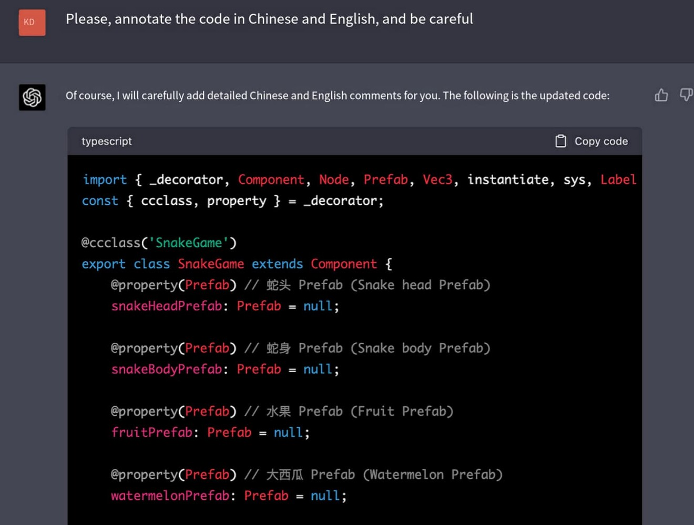

So here's the question: Would you be willing to be an AI UI Assembler in the future?

[poll type=regular results=always public=true chartType=bar]
* Yes, I do.
* Node, I don't
[/poll]