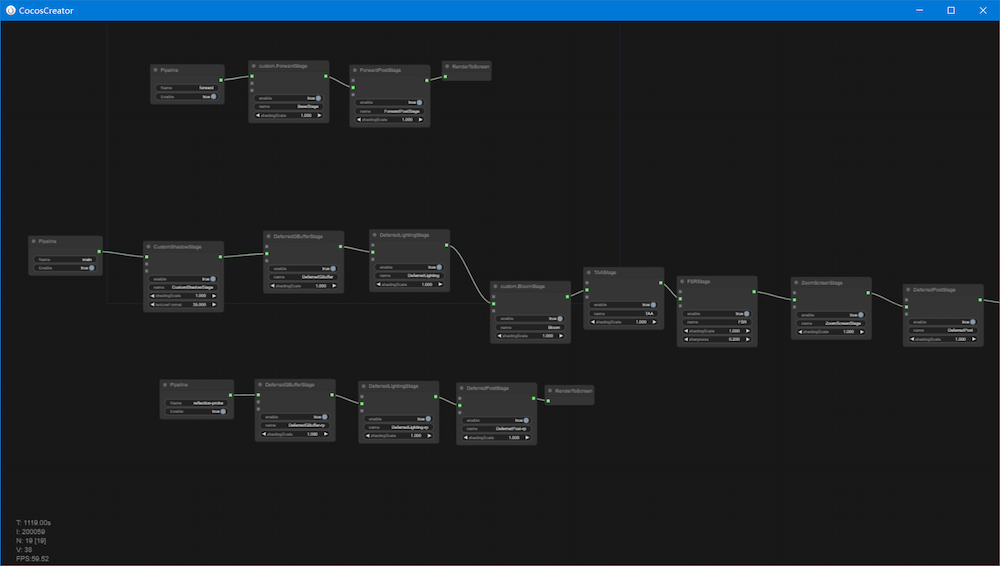
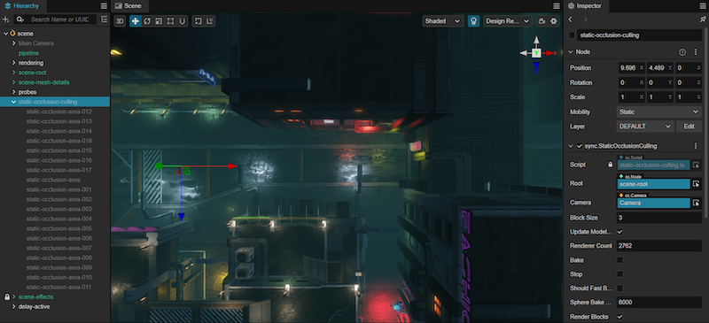

# 项目结构


Cocos Cyberpunk 是 Cocos 引擎官方团队以展示引擎重度 3D 游戏制作能力，提升社区学习动力而推出的完整开源 TPS 3D游戏，支持 Web, IOS, Android 多端发布。

本系列文章将从各个方面对源码进行解读，提升大家的学习效率。希望能够帮助大家在 3D 游戏开发的路上更进一步。

工程源码免费下载页面:
[https://store.cocos.com/app/detail/4543](https://store.cocos.com/app/detail/4543)

昨天写的文章被 **panda** 喷了，说内容有点水。

于是我赶紧去复习了一下昨天的文章内容：

- 1、**完整的TPS游戏核心逻辑框架**
- 2、**可复用的全新版本自定义管线**
- 3、**前向渲染、延迟渲染、后期处理管线**
- 4、**增强版环境反射探针使用经验与技巧**
- 5、**静态遮挡剔除**
- 6、**高中低端机型适配，让你的3D游戏在老年机上也能健步如飞**

咦，该宣传的点都宣传到位了呀！~~难道是对我这个托有什么不满？~~

大佬的心思咱也不敢瞎猜，接下来必须上干货了。

虽然麒麟子说了会做一个全方位解析，但就算是生产队的驴的产出速度，可能也跟不上大家求知若渴的节奏。

所以，今天麒麟子就先从项目结构做一个梳理，帮助大家快速找到对应模块的入口点。

## 来都来了，不玩玩？

在认真学习之前，推荐大家先玩半小时。

1、打开 **scene-game-start** ，启动游戏预览，即可进入游戏场景。


2、点击 **START** 就可以进入游戏


3、进入游戏后，会有一个漫游摄像机，带你漫游整个场景。 再次点击 **START** 按钮，游戏正式开始。


4、电脑端按 **ESC** ，手机端点击设置按钮即可查看操作说明。

## 项目目录结构

接下来，让我们看看项目目录结构。


如上图所示，当打开 **Cocos Cyberpunk** 项目后，可以看到左下角的 **Assets** 窗口中的文件内容。
我们从上到下解释一下。

### 1、animations

这个目录下只有一个 animation 文件，用于场景漫游的摄像机动画

### 2、LightFX

光照贴图目录，光照烘焙系统自动生成并使用的，不要手工修改里面的内容就行。

### 3、res

整个游戏的资源目录，包括了动画、特效、模型、shader、UI、音效等等

### 4、resources

游戏中需要动态加载的资源目录，会存放在这里。目前存放的内容不多，但随着游戏的完善，这个目录的内容可能会有所增加。

### 5、scene

环境反射探针(Reflection Probe)自动生成的反射贴图。反射探针在烘焙时，会生成与场景文件名对应的文件夹来存放反射贴图。这里的 scene 文件夹对应的就是下面的 scene 场景。

### 6、scene-development

存放一些开发过程中用于单元测试的场景，比如角色动画控制、子弹、IK、射击检测线等等。

### 7、scripts

存放所有的游戏逻辑脚本

### 8、src

一些开发过程中的测试，与项目无关

### 9、test

一些开发过程中的测试，与项目无关

### 10、scene

游戏主场景

### 11、scene-game-start

游戏启动场景，会进行UI一些逻辑管理器的初始化，并且加载游戏主场景，显示进度条。 应该从这个开始。

## 自定义管线

为了方便复用，自定义管线被做成了编辑器扩展的形式，如果你不想这样，也可以把它移到项目中去。pipeline 对应的就是自定义管线。


想要查看可视化的 pipepline 管线图，只需要在场景中新建一个节点，并把 pipeline/graph/pipeline-graph.ts 组件拖给新建的节点。


勾选 **Edit** 复选框，就可以打开下面这张图啦。



自定义管线相关的内容估计要写很多篇文章才能讲清楚，麒麟会在后面的文章中分享，今天就暂时不展开了。

有兴趣的朋友可以先查看以下文件，自行探索。

- pipeline/pipeline-manager（入口）
- pipeline/graph
- pipeline/passes

## 反射探针


在 scene 场景中，找到 probes，可以发现下面有三个反射探针，它们会在 assets/scene 目录下生成对应的图。

可以看到，在反射探针节点上还挂了一个 ReflectionUtils 脚本组件，这个组件提供了实时更新探针的功能。

如果有朋友的项目需要实时探针，可以参考这个脚本组件来实现。但要注意，实时探针开销很大，不适合渲染量太大的场景，也不适合数量太多。


除了这个以外，Cocos Cyberpunk 中的反射探针还做了 SphereProjection 修正，使得反射可以与物体吻合。

大概原理就是下面这样，用反射线与反射探针半径的交点与反射探针的中心构成新的方向，用于反射采样。


有兴趣的朋友可以先查看 pipeline/resources/effects/chunks/lighting_ibl.chunk，后面会有专门的文章解析这一块。

## 静态遮挡剔除

在 Cocos Cyberpunk 项目中，实现了一套简单易用的 PVS 机制。

通过将可见关系预先存入空间格子，在渲染时直接查表获得渲染列表，能够极大地提升效率，对建筑密集的场景最为实用。

这一个部分，可以查看 scene 场景中的 static-occlusion-culling 结点。



大概思路如下：

- 1、**将空间预先切分为许多格子**
- 2、**预先使用射线查询的方式，找出每一个格子可见的对象，并记录其ID**
- 3、**渲染时，计算出摄像机处于哪一个格子，获得对应格子的可见静态对象列表，仅渲染可见的静态对象**

主要的逻辑请参考 pipeline/occlusion-culling 部分。

## 机型适配

Cocos Cyberpunk 中实现了完整的机型分档和性能开关策略，这个策略会在高性能设备上采用最佳的渲染效果，而在较次的设备上通过关闭一些效果来确保帧率流畅。

这个部分可以说是所有 3D 项目都会用到的，大家可以将它搬到自己的项目中直接使用。

这个部分主要处理了以下两件事情

- 根据手机 GPU 信息，划分高、中、低端机型（已将常见 手机 GPU 芯片 纳入）
- 根据高中低端机型进行效果调节，确保低端机依然流畅

大家请参考 href-settings.ts、gpu.ts 和 gpu-mobiles.ts

可以看到，根据不同的设备分数，逐步关闭更多效果：

```ts
 let mobileSettings = [
    {
        score: 2000,
        shadingScale: Math.min(1240 / game.canvas.width, 1),
        bloom: 0,
        fxaa: 0
    },
    {
        score: 1200,
        shadingScale: Math.min(1024 / game.canvas.width, 1),
    },
    {
        score: 500,
        gpu: [['apple', 'a10']],
        fsr: 0,
        taa: 0,
        maxEnemies: 2,
        sceneParticles: 0
    }
]
```

大家可以手动切换到不同档次的效果来快速查看高、中、低端机上的表现。

## 游戏逻辑

Cocos Cyberpunk 中，也包含了完整的 TPS 游戏逻辑，对于想要学习射击类游戏、第三人称角色游戏，或者想基于此框架开发出自己的游戏的朋友，可以从 scene-game-start 场景的 init 节点开始。


从上图中我们可以看到，init 节点下包含了 fx、canvas、objects-pool 等节点。 从名字可以看出，这些节点分别对应特效、UI、对象池。

在 init 节点上挂了一个 init.ts 脚本组件，它的 start 函数中，我们可以看到，它将 init 设置为了常驻节点。

这样当主场景加载完后，切换到主场景时，init节点不会被销毁，继续保持游戏逻辑。

下一篇开始，麒麟子会对游戏逻辑相关源码做一个导读，敬请关注。

## 学习研究群

上一篇文章发出后不到三小时，便有许多小伙伴私聊我，要求建立一个Cocos Cyberpunk 的学习研究群。

现在这个群已经建立了，大家私聊麒麟子，发送自己打开了的 Cocos Cyberpunk 项目截图，就可以入群啦.
