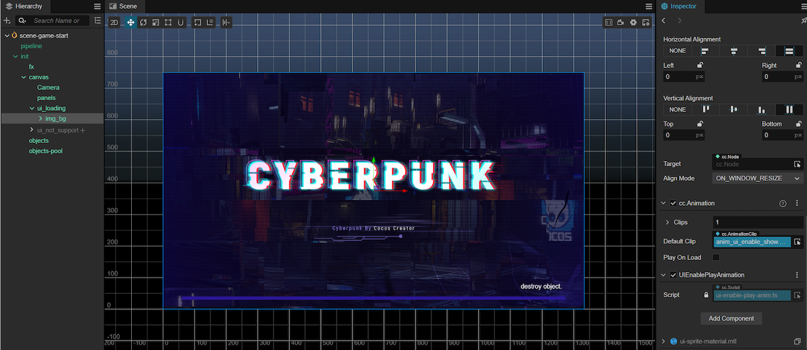
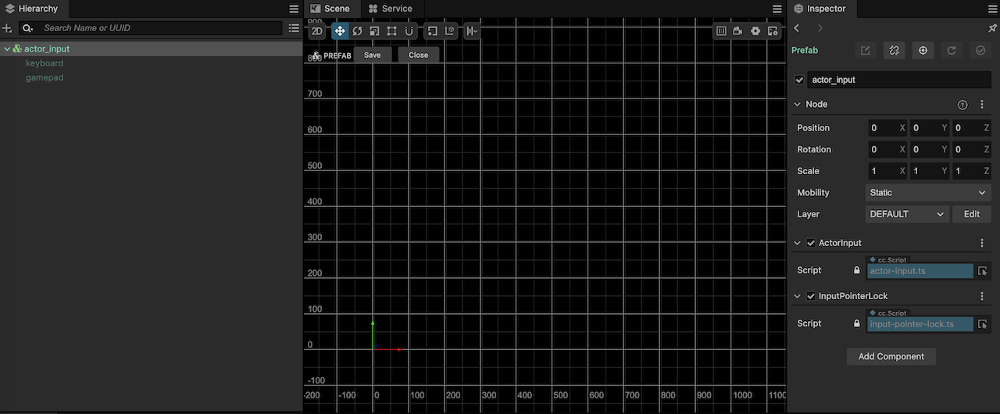
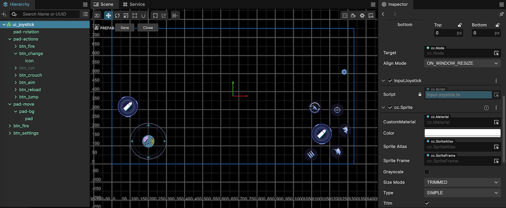
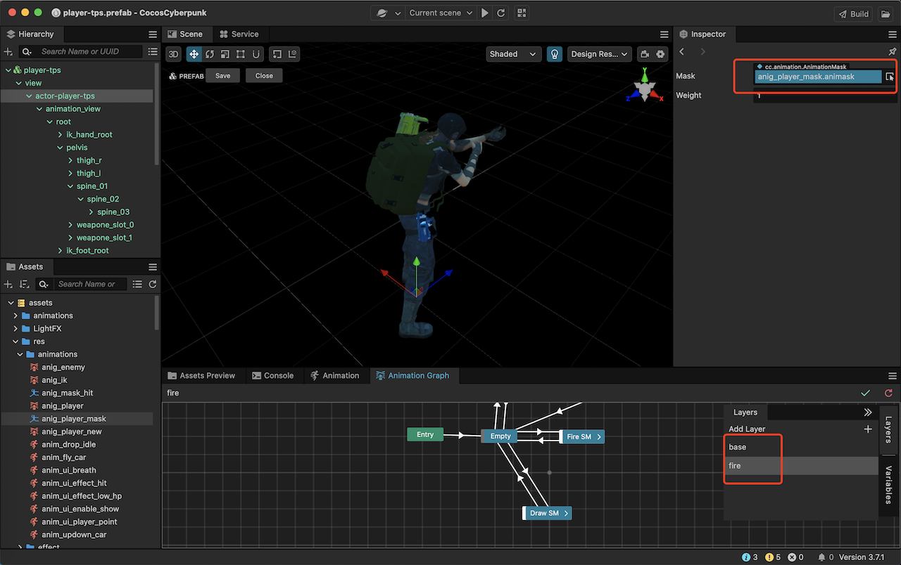
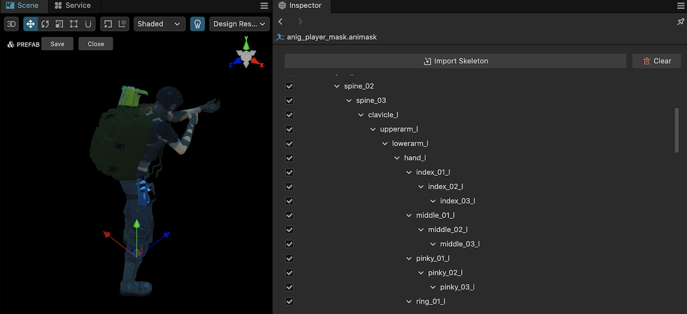
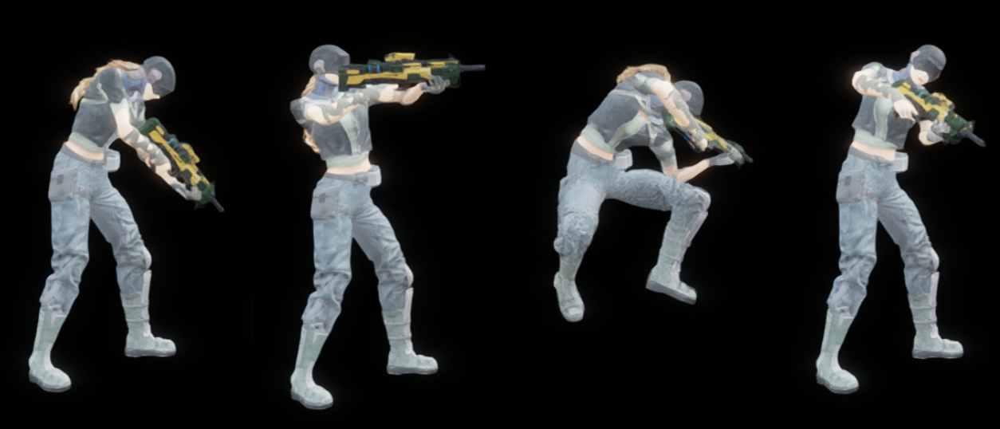
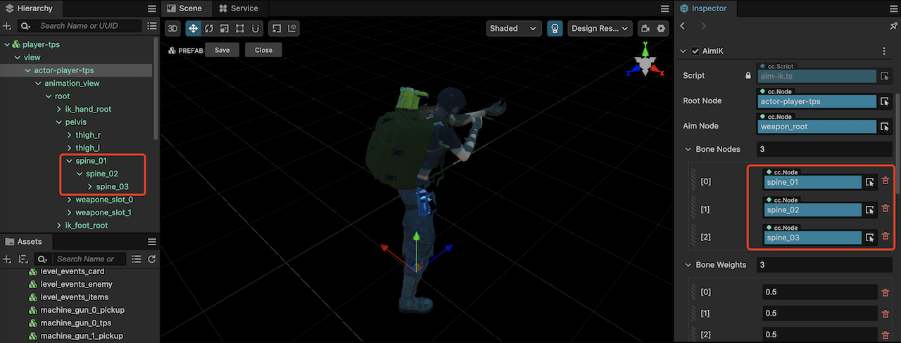

#


Cocos Cyberpunk 是 Cocos 引擎官方团队以展示引擎重度 3D 游戏制作能力，提升社区学习动力而推出的完整开源 TPS 3D游戏，支持 Web, IOS, Android 多端发布。

本系列文章将从各个方面对源码进行解读，提升大家的学习效率。希望能够帮助大家在 3D 游戏开发的路上更进一步。

工程源码免费下载页面:
[https://store.cocos.com/app/detail/4543](https://store.cocos.com/app/detail/4543)

麒麟子觉得，这篇文章至少可以让你节约好几天的研究时间。

**不信？你往下看！**

## 目录

其实这篇文章一开始不长这样，快要写完的时候，负责 Cocos Cyberpunk Gameplay 部分的大佬告诉我，这个部分会持续调整。

麒麟子这才意识到，过多的逻辑细节讲解会随着版本的更新而失去参考意义。

在向大佬了解了一些后续规划后，麒麟子决定推翻重来，从代码编写路数和逻辑运转机制的角度来做一个导读：

- 1、**预加载流程**
- 2、**【划重点】Data 与 Action**
- 3、**Game 模块导读**
- 4、**Level 模块导读**
- 5、**Actor 模块导读**
- 6、**主角控制**
- 7、**角色动画掩码与IK**
- 8、**怪物生成机制**
- 9、**物品掉落机制**
- 10、...

## 预加载流程


### 入口脚本 init.ts

上一篇文章简单提到过这个入口脚本 **init.ts**，它会检测设备是否支持 **WEBGL**，并在不支持的时候给予提示，还会将 **init** 节点设置为常驻，以确保游戏逻辑正常执行。

接下来，我们主要关注下面这段初始化函数：

```ts
...
// Load the resource cache data and execute the initialize game function.
ResCache.Instance.load(async () => {
    console.time('loadTextures')
    await loadTextures();
    console.timeEnd('loadTextures')
    Game.Instance.init();
});
...
```

可以看到，**init.ts** 中会先调用 **ResCache.load** 进行初始化，初始化完成后执行回调。

在回调函数中，调用 **loadTextures** 函数预加载 **resources/textures** 目录下的所有纹理。

最后再调用 **Game.Instance.init** 启动游戏逻辑。

### ResCache

**ResCache** 是一个单例类，它负责加载并缓存所需资源。

除了提供 **loadXXX** 系列方法，也提供了 **getXXX** 系列方法，所有预加载成功的资源都可以直接使用。

进入 **ResCache.load** 函数可以看到，它先是加载了 **data/data-res-cache.json** 文件，再根据文件中的配置，预加载对应的 **json**，**sprite** 和 **sound**。

同时，**ResCache.load** 会向外发布 **msg_loading** 事件，**UILoading** 监听到此事件后，就会显示出来。



在 **loading** 阶段，**ResCache** 也承担了加载进度统计的职责，查看 **addLoad** 和 **removeLoad** 方法被调用的地方就可以一目了然。

当资源预加载结束，场景会由 **scene-game-start** 切换为 **scene** 场景，并且显示出 **resources/ui/ui-logo.prefab**。


## 【划重点】Data 与 Action

**应该有很多朋友和麒麟子一样，尝试去寻找场景切换和 UI 显示的相关的代码，但没有找到。**

麒麟子咨询了负责 Gameplay 的大佬后，才恍然大悟：**整套游戏逻辑代码，参考了行为树的节点设计机制，基于数据（data）和行为（action）来驱动**。

游戏中的 **player** 是对象，**enemy** 是对象，作用于全局的管理器 **game** 和 **level** 等也是对象。

### Data

每一个对象，都拥有一个 **data-xxx.json** 配置文件，你可以在 **resources/data**下找到它们，比如：

- **game**: data-game.json
- **level**: data-level.json
- **player**: data-player.json
- **enemy**: data-enemy_1.json
- **boss**: data-boss_0.json

这些文件中的数据字段，与用来解析它的类是一一对应的。比如：

- **game** -> game.ts
- **level** -> level.ts
- **player** -> actor.ts
- **enemy** -> actor.ts
- **boss** -> actor.ts

所以，你会发现，**data-player.json**，**data-enemy_1.json** 与 **data-boss_0.json** 的内容格式是差不多的。 但与 **data-game.json** ， **data-level.json** 的差别就很大。

### Action

每一个对象，都拥有一个 **action-xxx.json** 配置文件，你可以在 **resources/action** 下找到它们，比如：

- **game**: action-game.json
- **level**: action-level.json
- **player**: action-player.json
- **enemy**: action-enemy_1.json
- **boss**: action-boss_0.json

与 **Data** 类似，**Action** 配置文件的内容也与执行它的类相关，同类会采用相近的配置格式。

每一个 **Action** 文件中，都定义了一系列的 **Action Node**。

对象可以根据条件，触发不同的 **Action Node**。

每一个 **Action Node** 都拥有两个命令：**start** 和 **end**。

**start** 会在 **Action Node** 进入时执行， **end** 会在 **Action Node** 离开时执行。

而每一个 **start** 和 **end** 命令在执行时，又可以按序执行多个操作。

用于解析 **action-xxx.json** 配置文件的类在 **action.ts** 脚本中。

进入到 **action.ts**，我们可以看到 **Action** 类有两个主要的函数：

- **on**: 执行 start 命令
- **off**: 执行 end 命令

在 **UtilAction** 中，定义了 **start** 和 **end** 可以执行的所有操作。 比如：

- **on_ui/off_ui**: 打开/关闭 UI
- **on_inst_pool**: 初始化对象池
- **on_bgm**: 播放背景音乐
- **on_scene**: 切换场景
- ...

接下来我们用 **game** 对象来讲述一下 Data & Action 的运转机制。

## Game 模块

**Game** 模块涉及到的 3 个主要文件：

- **data-game.json**
- **action-game.json**
- **game.ts**

先来看看两个 json 配置文件的关键内容：

### data-game.json

```json
{
    ...
    "fps":60,
    "start_node":"logo",
    "action_data":"action-game",
    "version":"version:202302271037",
    "show_version":"V1.2",
    ...
    "res_ui_root":"ui/",
    ...
}
```

在 **data-game.json** 中，我们可以看到它定义了许多东西，比如限定的帧率，版本号等等。

这里我们还应该关注 **start_node** 和 **action_data** 这两个值，这是游戏启动流程的关键数据。

- **action_data**: 用于指定对应的 Action 配置文件
- **start_node**: 用于指定默认的 Action Node。

### action-game.json

```json
{
    "logo": {
        "start": [ ... ],
        "end": [ ... ]
    },
    "level": {
        "start": [ ... ],
        "end": [ ... ]
    },
    ...
```

可以看到在 **action-game.json** 定义了许多 action，最关键的两个：

- **logo**: 显示 Logo 和开始按钮时的状态
- **level**: 关卡状态，此时可以操作主角进行战斗

### game.ts

在 **game.ts** 的 **init** 方法中，我们可以看到下面两条代码

```ts
// Initialize the game data.
this._data = dataCore.DataGameInst._data;
// Initialize game action data.
this._action = new Action(this._data.action_data);
...
// Push the game initial node into the stack data.
this.push(this._data['start_node']);
```

第一行代码，是获得从 **data-game.json** 加载到的配置数据。

第二行代码，是使用 **action_data**（值为 '**action-game.json**'） 去创建一个 Action。

第三行代码，是使用 **start_node**（值为 **logo**） 去作为 **game** 的初始 **action**。

我们再来看看， **action-game.json** 中 **logo** 节点的具体内容：

```json
{ "time": 0, "name": "on_ui", "data": "ui_logo" },
{ "time": 0.1, "name": "on_inst_pool", "data": "gun_tracer_pool"},
{ "time": 0.15, "name": "on_inst_pool", "data": "sfx_heart"},
{ "time": 0.2, "name": "on_inst_pool", "data": "random-fly-car"},
{ "time": 0.3, "name": "on_inst_pool", "data": "level_events"},
{ "time": 0.4, "name": "on_bgm", "data": "bgm_logo"},
{ "time": 0.5, "name": "on_scene", "data": "scene"}
```

翻译为执行流程就是：

- 显示 ui_logo
- 初始化对象并放入对象池
- 播放背景音乐 bgm_logo
- 切换到场景 scene

>**Tips**: 前面的 time 的单位是秒，用于分帧处理。 如果想快速处理完，可以全部填 0。

到这里，**Game** 模块的导读就结束了，相信有了上面的讲解，**Game** 模块的代码阅读会轻松不少。

## Level 模块

**Level** 模块用于负责关卡相关的状态控制，它没有具体的行为。

它只是一个容器，将主角、怪物、物品掉落、寻路、存档等功能连接在一起。

当用户点击 START 按钮后，会执行 **action-game.json** 中的 **level** Action。

```ts
"level": {
    "start": [
        { "time": 0, "name": "on_bgm", "data": "bgm_level"},
        { "time": 0, "name": "on_ui", "data": "ui_fx" },
        { "time": 0, "name": "on_msg", "data": "msg_level_start" },
        { "time": 0.2, "name": "on_msg_str", "data": { "key":"msg_set_camera", "value": false } },
        { "time": 2, "name": "on_ui", "data": "ui_level" }
    ],
    ...
}
```

可以看到，这里做了以下操作：

- 播放背景音乐 bgm_level
- 显示UI ui_fx
- 发送事件 msg_level_start
- 发送事件 msg_set_camera, false
- 显示UI ui_level

**Level** 模块也涉及到了三个主要文件：

- **data-level.json**
- **action-level.json**
- **level.ts**

### data-level.json

```ts
{
    "name":"Cyberpunk Scene",
    "total_time":300,
    "close_blood_fx": true,
    "each_rate_value":10000,
    "killed_to_score":100,
    "survival_time_to_score":10,
    "level_events":"level_events",
    "prefab_player":"player-tps",
    "prefab_enemy":"enemy-tps",
    "prefab_drop_item":"drop_item",
    "enemies":["enemy_0", "enemy_1", "enemy_2", "boss_0"],
    "fx_dead":"fx_dead_white",
    "score_level":[...],
    "items":[...],
    "probability_drop_enemy":{...},
    "probability_drop_items":{...},
    "cards":["life", "attack", "defense", "special"],
    "probability_drop_card":{...}
}
```

我们可以看到，在 **Level** 模块的数据配置文件中，包含了：

- 击杀分数
- 重生时间
- prefab信息
- 怪物信息
- 掉落物品信息
- 分数评级
- ...

通过修改这些配置，就可以改变关卡数据和玩法。

### action-level.json

```ts
{
    "start":{...},
    "warning":{ ... },
    "end":{...}
}
```

而关卡的 Action 配置文件，则相对简单，只有 **start**、**warning** 和 **end** 三种情况。

```ts
"start":{
    "start":[
        { "time": 0.2, "name": "on_msg_str", "data": { "key":"level_do", "value":"addPlayer" } },
        { "time": 0.5, "name": "on_inst", "data": "level_events_enemy" },
        { "time": 0.6, "name": "on_inst", "data": "level_events_items" }, 
        { "time": 0.7, "name": "on_inst", "data": "level_events_card" }
    ]
},
```

在 **start** 命名中我们可以看到，当关卡加载时，会执行以下操作：

- **on_msg_str**：level_do, addPlayer
- **on_inst**：level_events_enemy
- **on_inst**：level_events_items
- **on_inst**：level_events_card

### on_msg_str

从 **action.ts** 的 **UtilAction** 类中，我们可以看到， **on_msg_str** 的方法原型为：

```ts
  public static on_msg_str (data: key_type_string) {
      Msg.emit(data.key, data.value);
  }
```

不难看出，它的功能就是向外发出一个事件，并带有一个参数。

接下来我们看看在脚本代码中，是如何执行这些操作的。

```ts
{ "time": 0.2, "name": "on_msg_str", "data": { "key":"level_do", "value":"addPlayer" }
```

在这里就是：发出一个 **level_do** 消息， 参数为 **addPlayer**。

打开 **level.ts** 我们可以看到，在它的 **init** 函数中，监听了这个消息：

```ts
Msg.on('level_do', this.do.bind(this));
```

**level.ts** 中 **do** 函数的原型如下：

```ts
public do (fun: string) {
    this[fun]();
}
```

由此可以看出， **action-level.json** 中的第一个操作，其实就是调用 **Level** 的 **addPlayer** 函数。

### on_inst

从 **action.ts** 的 **UtilAction** 类中，我们可以看到， **on_msg_str** 的方法原型为：

```ts
    public static on_inst (key: string, actor: Actor) {
        var asset = ResCache.Instance.getPrefab(key);
        var obj = Res.inst(asset, Level.Instance._objectNode);
        if (actor && actor._viewRoot) {
            obj.parent = actor._viewRoot!;
            obj.setPosition(0, 0, 0);
        }
    }
```

从上面的原型中可以看出，**on_inst** 方法就是实例化一个指定的对象。

这个指定对象参数是 **prefab** 的名称。

- level_events_enemy
- level_events_items
- level_events_cards

都是 **prefab**，对应的资源在 **assets/resources/obj** 目录下。

**ResCache** 在预加载阶段会将目录下的 **prefab** 都加载完，并按 **prefab** 名称存储下来。 使用的时候直接使用名称查询就可以了。

具体逻辑请参考 **ResCache** 类中的 **loadPrefab**、**setPrefab** 和 **getPrefab**。

## Actor 模块

接下来我们来讲讲大家最关心的**主角控制**、**怪物生成**以及**可拾取物品生成**相关内容。

但在讲这些内容之前，我们先来看看 **Actor** 模块。

在前面的内容中，我们提到过，当你打开 **action-player.json**，**action-enemy_1.json**，**action-boss_0.json**
这些文件时，你会发现它们的内容格式都差不多。
这是因为，**主角**、**怪物**、**BOSS** 对应的类都是 **Actor**。

打开 **data-player.json** 或者是 **data-enemy_1.json** 文件，都可以看到 **action 配置文件名**、**音效**、**最大血量**等信息。

```ts
{
    "name":"actor-enemy_0",
    "action":"action-enemy_0",
    "sfx_walk_ground":"sfx_walk_ground",
    "sfx_walk_grass":"sfx_walk_grass",
    ...
    "strength": 100,
    "max_strength": 100,
    "max_hp":60,
    ...
```

打开对应的 **action-xxx.json**，你可以看到有 **play**、**jump**、**dead**、**pickup** 等命令。

而每个命令会执行以下命令：

- **on_call**：调用当前 actor 上指定的函数名
- **on_set**：设置当前 actor 上指定的变量值
- **on_anig**：设置当前 actor 上动画图的变量
- **on_sfx**：播放音效

具体的函数原型，大家可以自己去 **action.ts** 里查看。

以上动作的载体就是 **Actor**。

## 主角控制

### 初始化

主角使用的 **prefab** 路径为 **resources/obj/player-tps.prefab**，这个在 **data-player.json** 中有配置。

我们从 **level.ts** 中的 **addPlayer** 函数继续讲。

```ts
public addPlayer () {
    //获得 player 的 prefab
    const prefab = ResCache.Instance.getPrefab(this._data.prefab_player);
    //通过 prefab 生成 player 实例
    const resPlayer = Res.inst(prefab, this._objectNode!, this._data.spawn_pos);
    // 获取 Actor 组件
    this._player = resPlayer.getComponent(Actor)!;
    // 标记这个 actor 为主角
    this._player.isPlayer = true;
    // 使用 data-player.json 初始化这个 actor
    this._player.init('data-player');
}
```

上面是 **addPlayer** 中的关键步骤。接下来，我们继续看 **this._player.init**  这段代码做的事情。

这段代码会先调用 **ActorBase.init** 完成一些基本的初始化工作，然后再调用 **Actor.initView**。

在 **Actor.initView** 中的最后一步，会调用 **play** Action，启动对象。

在 **action-player.josn** 中，我们可以看到 **play** 的内容如下：

```ts
"play":{
    "start":[
        { "time": 1, "name": "on_call", "data": "onUpdate"},
        { "time": 1.5, "name": "on_inst_scene", "data": "actor_input"},
        { "time": 1.5, "name": "on_com", "data":"ActorStatistics"},
        { "time": 1.5, "name": "on_com", "data":"ActorSound"},
        { "time": 2, "name": "on_msg_str", "data": { "key":"msg_set_input_active", "value": true} }
    ]
},
```

它做了以下几件事：

- 调用 **onUpdate** 函数
- 实例化 **actor_input** 对象
- 为 player 添加 **ActorStatistics** 和 **ActorSound** 组件
- 发送 **msg_set_input_active** 事件，激活输入

### 用户输入

```ts
{ "time": 1.5, "name": "on_inst_scene", "data": "actor_input"},
```

上面这条语句执行的就是将 **resources/obj/actor_input.prefab** 实例化，并添加到场景节点上。



在 **actor_input.prefab** 上有一个 **ActorInput** 组件，它的功能就是处理用户的输入。

进入 **actor-input.ts** 文件中，在 **ActorInput** 类的 **initInput** 方法中我们可以看到，它会做平台判断。 当处于移动端的时候，会启动 **joysitck** 方式。 反之，则使用鼠标键盘操作。



**input-joystick.ts** 和 **input-keyboard.ts** 不会直接控制角色，而是会把所有的操作指令交给 **ActorInput** 组件来处理。

在 **ActorInput** 实现了所有的用户操作，如 **onMove**、**onJump**、**onRotation**、**onRun** 等等。

### 主角摄像机


在 **player-tps.prefab** 中，我们可以找到 **camera-root** 节点，这个节点上挂了三个组件：

**CameraTps**：用于控制摄像机的上下旋转。由于摄像机的正方向总是与主角对齐的，所以不需要控制左右。

**CameraMoveTarget**：用于控制摄像机的缓动效果

**SensorRayNodeToNode**：用于摄像机与场景的碰撞检测

## 角色动画掩码与IK

射击游戏中，有两个最主要的功能：

- **边移动边开枪**
- **根据镜头方向改变端枪姿势**

在 **Cocos Cyberpunk** 中也实现了。

### 角色动画掩码

**Cocos Creator** 提供了动画图功能，并且提供了 分层动画与掩码功能。

**分层动画**：简单来说，就是用户可以同时播放多个动画，并且通过权重来进行混合。

**动画掩码**：标记动画在播放时，哪些骨骼需要更新。

在 **Cocos Cyberpunk** 中，角色（主角和怪物）的动画图有两层 **base** 和 **fire**。



可以看到 **fire** 的权重为 1.0，由于 **fire** 在分层图中的索引靠后，优先级较高，所以当 **base** 和 **fire** 同时播放的时候，**fire** 会替换掉动画。

假如我们想要实现移动中射击，那我们希望的是 **base** 层播放**移动**，**fire** 层播放**射击**，并且 **fire** 只影响上半身。

这时，就需要用到动画掩码。

双击打开 **anig_player_mask** 可以看到，所有的上半身骨骼都被选中了。 也就是说，**fire** 动作在播放时，只会进行上半射更新。



### 角色IK



如上图所示，我们需要根据镜头方向改变端枪姿势，才能保证游戏的射击体验。

这就需要用到我们的 **IK**。

在 **player-tps.prefab** 中找到 **actor-player-tps** 节点，可以看到它上面挂了两个组件：

**AimIK**：用于绑定IK相关数据。端枪描准姿势主要受脊柱上 **spine01**，**spine02**，**spine03** 三根关节的影响，组件里对它们进行了引用。

**AimControl**：用于实现描准控制



**IK** 相关的代码在 **scripts/core/ik** 目录下，有兴趣的朋友可以深入研究。

## 怪物生成机制

### 配置

让我们从 **action-level.json** 中的 **start** Action 说起：

```ts
{ "time": 0.5, "name": "on_inst", "data": "level_events_enemy" },
```

当 **Level** 开始后，会创建 **level_events_enemy** 的实例，它在关卡中只有一个，是负责怪物生成和销毁的管理器。

与它相关的资源：

- **resources/obj/level_events_enemy.prefab**
- **resources/obj/boss_0.prefab**
- **resources/obj/enemy_0.prefab**
- **resources/obj/enemy_1.prefab**
- **resources/obj/enemy_2.prefab**
- **level_events_enemy.ts**

打开 **level_events_enemy.ts** 可以看到，在 **LevelEventsEnemy** 中使用了 **data-level.json** 中的 **probability_drop_enemy** 作为数据源，内容如下：

```ts
"probability_drop_enemy":{
    "interval":[2, 4],
    "interval_weight_max":1,
    "life_time":[30, 40],
    "max": 4,
    "init_count":[7, 10],
    "weights":[0.4, 0.7, 0.9, 1],
    "weights_max":[4, 4, 4, 1],
    "weights_group":[ 0, 1, 2, 3]
},
```

可以看到，它定义了刷新间隔，最大怪物数量等等。

### 生成

**LevelEventsEnemy** 中主要函数为 **generateEvent**，它会判断怪物数量是否需要生成。

如果符合生成条件，它会从 **data-level.json** 的 **enemies** 中随机一种怪物的外观。

```ts
"enemies":["enemy_0", "enemy_1", "enemy_2", "boss_0"],
```

得到外观后，再随机一个行为组，组合成数据，发出 **msg_add_enemy** 事件。

```ts
const currentIndex = this.probability.weights_group[occurGroupIndex];
const res = DataLevelInst._data.enemies[currentIndex];
// Send add add enemy.
Msg.emit('msg_add_enemy', { res: res, groupID: occurGroupIndex })
```

还要特别注意的是，当 boss 出现时，它还会发出警告。（麒麟子觉得，这个配在 **action-boss_0.json** 中可能会更好）

```ts
  if (res == 'boss_0'){
      Msg.emit('level_action', 'warning');
  } 
```

同时，它也会响应 **msg_remove_enemy** 事件，处理怪物被删除的情况。

然后，在 **addEnemy** 中，从寻路系统中随机出一个可用的位置点，进行怪物创建：

```ts
  //从寻路系统中获取一个可用点
  const point = NavSystem.randomPoint();
  //创建 enemy
  var enemy = ResPool.Instance.pop(data.res, point.position); 
  const actor = enemy.getComponent(Actor);
  //初始化怪物数据      
  actor.init(`data-${data.res}`);
```

### 怪物AI

打开 **boss_0.prefab** 或者 **enemy_0.prefab**，可以看到两个与怪物 **AI** 相关的组件：

**ActorBrain**：
真正的 **怪物AI** 驱动器，会根据周围环境执行相应动作。

**ActorInputBrain**：
转接器，方便将 **怪物AI** 行为转递给 **ActorInput**。

## 可拾取物品掉落机制

### 配置

和 **level_events_enemy** 相似，在 **Level** 加载成功后，会生成一个用于可拾取物品的管理器：

```json
{ "time": 0.6, "name": "on_inst", "data": "level_events_items" }, 
```

与它相关的资源：

- **resources/obj/level_events_items.prefab**
- **resources/obj/drop_item.prefab**
- **level_events_items.ts**
- **drop-item.ts**

在 **level_events_enemy.ts** 中，会使用 **data-level.json** 中的 **probability_drop_items** 字段做为配置数据：

```json
    "probability_drop_items":{
        "interval":[5, 30],
        "life_time":[30, 40],
        "max": 4,
        "interval_weight_max": 1,
        "init_count":[7, 10],
        "weights":[0, 0.125,0.25, 0.375,0.75,1],
        "weights_max":[1, 1, 1, 1,2,2],
        "weights_group":[0, 1,2, 3,4,5]
    },
```

可以看出，它和怪物生成类似，也配置了一些生成相关的参数。

### 生成

在 **level_events_items.ts** 中，不会处理实际的物品生成，它会监听 **msg_remove_item** 事件，调整自身数据。

当判定可以生成新物品时，会发出 **msg_remove_item** 事件。

在 **level.ts** 中，会监听这个事件并执行 **addDrop** 方法。

在 **addDrop** 方法中，会生成 **drop_item.prefab** 的实例。

### 拾取

在主角 **player-tps.prefab** 的 **sensor_detect_drop** 节点上，有 **SensorRays** 和 **ActorSensorDropItem** 两个组件。

**SensorRays**：会定期检查主角周围的对象，并存到 **checkedNode** 变量上。

**ActorSensorDropItem**：会做一些判断，并更新状态，同时将 **checkedNode** 保存为 **pickedNode**。

**ui_level.prefab** 中的 **grp_take_info** 上有一个 **UIDisplayByState** 组件，它会检测这个状态，并显示出 “**按E拾取**” 这个提示。

当物品被拾取后，**Actor** 的 **onPicked** 方法会被调用，并发出 **picked** 事件。

**drop_item.prefab** 上的 **DropItem** 组件会响应 **picked** 事件并销毁回收自己。

#### 自动拾取

在主角 **player-tps.prefab** 上挂了一个 **CheckAutoPick** 组件，当处于移动端时，会自动调用 **Actor** 的 **onPicked** 方法。

## 最后来几句

>由于 **UI系统** 和 **寻路系统** 涉及的内容太多，会专门用两篇新的文章来讲解。

希望这篇文章，能够帮助到想要研究 **Cocos Cyberpunk** 项目源码的朋友。

大佬花了几个月时间写完的 **Gameplay**，显然是麒麟子用两天时间无法吃透的。

希望更多朋友能够一起研究，一起产出一些学习心得、教程，让 **Cocos Cyberpunk** 这个开源项目发展得更好。

下一篇不出意外，会写**自定义管线**，敬请期待。

## 附1：类名 <---> 文件名

在 **Cocos Cyberpunk** 项目中，类名采用大驼峰命名法，即首字母大写的方式。

与类名对应的 ts 文件，则采用小写单词并用“-”连接的方式。

比如：

- **UILoading -> ui-loading.ts**
- **CameraController -> camera-controller.ts**

掌握这个对应关系，保证你能很快定位到想要的代码。

## 附2：两种单例写法

细心的朋友会发现，**Cocos Cyberpunk** 中有两种单例写法。

一类是传统的，适合所有面象对象语言的模式：**Singleton**。

通过 **类名.Instance** 访问，如：

- UI.Instance
- ResCache.Instance
- Level.Instance
- GameSet.Instance

这样做的好处是：**可以随时调用，会在第一次被调用时初始化**。

但不好的地方是：**所有类都会直接被不同的文件引用，当类名修改或者移动文件时，涉及到的文件会非常多**。

另一类是适合 TS，JS，C++ 这种支持全局变量的语言。 参考 **data-core.ts**：

```ts
import { DataEquip } from "../../logic/data/data-equip";
import { DataSound } from "../../logic/data/data-sound";
import { DataCamera } from "./data-camera";
...

export const DataEquipInst = new DataEquip();
export const DataSoundInst = new DataSound();
export const DataCameraInst = new DataCamera();
...

export function Init () {
    //Init data.
    DataEquipInst.init('data-equips');
    DataSoundInst.init('data-sound');
    DataCameraInst.init('data-camera');
}
```

这种写法，使用起来相当灵活。
可以像这样使用：

```ts
import * as dataCore from "./data-core";
dataCore.DataEquipInst.foo();
```

也可以像这样使用：

```ts
import { DataEquipInst } from '../data/data-core';
DataEquipInst.foo();
```

这种写法的好处是：**所有引用的地方只依赖一个容器文件，发生重构时影响非常小**。

但也有一些较小的坏处：**可能会有多人同时维护同一个容器文件，并且需要一个适合的地方调用初始化函数**。

相比而言，麒麟子更喜欢第二种，会让代码变得更易维护。

>**Tips：**其实第二种方式并不新鲜，与在静态类中持有各实例对象的做法是一样的。只是得益于 TS 这类可以使用全局变量的语言特性，才可以用这样的方式编写。
