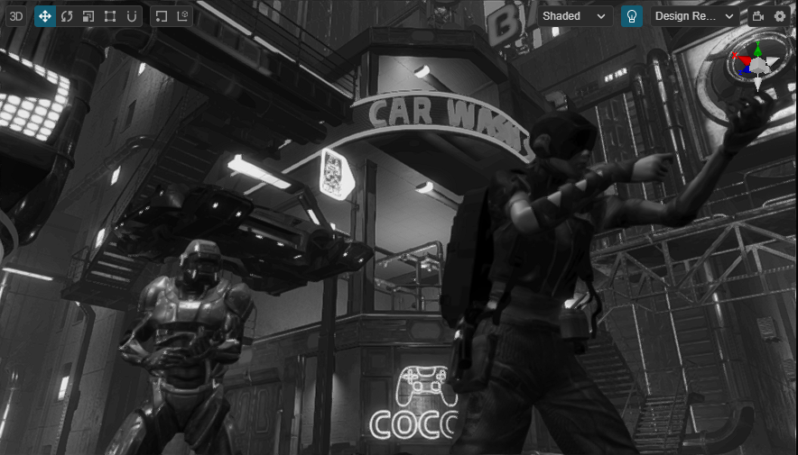
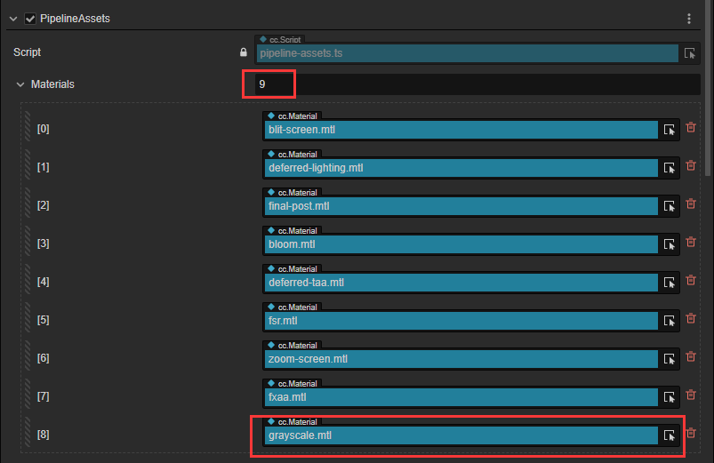
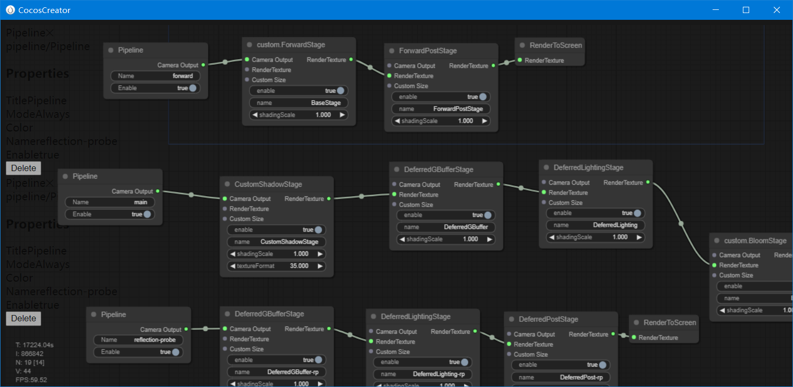
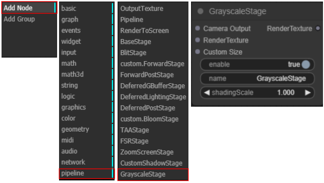

# 手把手教你写后处理效果 Shader

前一篇文章中，我给大家分享了如何在自己的项目中集成 Cocos Cyberpunk 中已经写好的 CRP 方案。

这篇文章，将教大家，如何在 Cocos Cyberpunk 的 CRP 方案中新增一个自己的后处理效果。


Cocos Cyberpunk 是 Cocos 引擎官方团队以展示引擎重度 3D 游戏制作能力，提升社区学习动力而推出的完整开源 TPS 3D游戏，支持 Web, IOS, Android 多端发布。

本系列文章将从各个方面对源码进行解读，提升大家的学习效率。希望能够帮助大家在 3D 游戏开发的路上更进一步。

工程源码免费下载页面:
[https://store.cocos.com/app/detail/4543](https://store.cocos.com/app/detail/4543)

今天的内容相对比较简单，既适合年轻人把玩，也适合中老年娱乐，一定要看完哟。

上一篇文章，给大家分享了 **如何将 Cocos Cyberpunk 中的自定义渲管线(CRP)搬到自己的项目中**。

看着那 **Bling** **Bling** 的效果，很多朋友也是跃跃欲试，但刚准备动手就卡住了。于是跑过来问：

- **那个自定义管线的 Shader 怎么写啊？**
- **那个渲染管线图是怎么连的啊？**
- **我想自己增加一个效果，怎么整啊？**

别急，这就安排！

谁让麒麟子这（是）么（个）好（专）说（业）话（托）呢。

大家可能发现了，虽然麒麟子的文章开头都会有一段用于缓和紧张的学习气氛的句子，但文章结构依然保持了 **总-分-总** 结构。

因这样的结构很适合用于分享学习内容。

如果还有更好的建议，欢迎随时告诉我，我会根据情况做调整。

话不多说，我们开始吧。

## 内容提要

想要在 **Cocos Cyberpunk** 的 **CRP** 中新增一个后期效果，只需要需要解决下面几个问题就好了：

1. **新增什么后期效果**
2. **如何编写一个 Pass**
3. **如何将一个 Pass 加入到管线**

接下来我们逐一搞定它们。

## 选择效果

**Cocos Cyberpunk** 中已经内置了 **Bloom** 和 **TAA** 两个出场率 90%+ 的后处理。如果还要加的话，应该还有：

- **Lut**
- **Vignette**
- **DoF**
- **Motion Blur**
- **SSR**
- **SSAO**

除了 **Lut** 和 **Vignette** 非常简单以外，其余的都很难搞。

列出来就是为了让大家看看。

这篇文章的目的，是演示添加一个后效效果的工作流程，所以没有必要搞得那么复杂，我们实现一个简单的效果就好了。

有了！我们可以实现一个让画面变灰的效果。

这个效果虽然简单，但可以作为玩家角色死亡时的画面变灰处理，以增强游戏氛围，实用价值也不小。

先来张效果图，避免观众流失了！



## 编写一个 Pass

### 资源目录

我们先来看看一个 **Pass** 涉及到哪些内容：

- **pipeline/passes**：相关脚本
- **pipeline/resources/effects**：相关 Shader
- **pipeline/resources/materials**：相关材质

### Pass 代码

接下来，我们先忽略所有原理和细节，快速实现一个变灰效果，从而掌握流程。

#### 1、从 fxaa 快速构建

我们新建一个 **grayscale-pass.ts**，然后将 **fxaa.ts** 中的内容复制过来。

#### 2、修改代码内容

修改与类名相关的代码如下（逐行检查）：

```ts
@ccclass('GrayscalePass')
export class GrayscalePass extends BasePass {
    _materialName = 'grayscale';
    ...
    @property({ override: true })
    name = 'GrayscalePass';
    
    @property({ override: true })
    outputNames = ['GrayscalePassColor'];
    ...
    render(camera: renderer.scene.Camera, ppl: rendering.Pipeline){
      ...
      passUtils.addRasterPass(width, height, 'post-process', `Camera_Grayscale_Pass${cameraID}`);
      ...
    }
}
```

删除下面这些代码：

```ts
...
checkEnable () {
    return super.checkEnable() && !!HrefSetting.fxaa;
}
...
_offset = new Vec2
texSize = new Vec4
...
material.setProperty('texSize', this.texSize.set(width, height, 0, 0))
```

好了，我们的 **grayscale-pass.ts** 就制作好了。

### Cocos Shader

接下来，我们制作让画面变灰的 **Shader**。

为了快速实现，我们还是先复制 **pipeline/resources/fxaa.effect**，改名为 **grayscale.effect**。

将 main 函数改为如下内容：

```glsl
void main () {
  vec4 color = texture(inputTex,v_uv);
  float Y = 0.2126 * color.r + 0.7152 * color.g + 0.0722 * color.b;
  fragColor = vec4(Y,Y,Y ,1.0);
}
```

为了 Shader 代码的整洁，我们删除掉用不上的部分：

```glsl
#include <unpack>
#include <./chunks/fxaa>
...
uniform Params {
  vec4 texSize;
};
```

注意， **in vec2 v_uv;** 可别误删了，要留着。

好了，我们的Shader就准备好了

### 材质

材质是最简单的了，只需要在 Cocos Creator 中复制 **pipeline/resources/fxaa.mtl**，并改名为 grayscale。

然后把它的 effect 指定为 grayscale.effect 就可以了。

到这里， 一个 GrayscalePass 就制作完成啦。

## 加入新的 Pass

### 材质加载

1、双击 **pipeline/resources/pipeline.prefab**。

2、在属性面板中，找到 **PipelineAssets** 组件。

3、将 **Materials** 后面的数字加1（没有改过的话，应该是8，我们把它变成0），可以看到最下方空出来一个元素。



4、将 **pipeline/resources/materials/grayscale.mtl** 拖进去，保存 **pipeline.prefab**。

材质就会在 **pipeline** 启动的时候加载啦。

### 添加 GrayscalePass 到 Graph 数据

为了能够在 **CRP Graph** 中添加节点，我们需要先将 **GrayscalePass** 注册到 **graph** 数据里。

打开 **pipeline/graph/nodes/pass.ts**，在末尾追加一行代码：

```ts
createPassGraph(BasePass);
createPassGraph(BloomPass);
...
//GrayscalePass
createPassGraph(GrayscalePass);
```

### 添加节点

~~按照之前教过的方法~~
算了，再从头教一次吧。

#### 打开 CRP Graph

1. 新建一个空节点
2. 将 **pipeline/graph/pipeline-graph.ts** 组件拖到这个节点上
3. 勾选组件上的 **Edit** 复选框，就会弹出 **RenderPipeline Graph** 窗口


你可以看到下面这样的窗口：


#### 添加 GrayscalePass

在窗口中点击右键，会弹出第一级菜单，选择 **AddNode**。

在弹出的新菜单中，选择 **pipeline**（最底部）。

接下来，在弹出的新菜单中选择 **GrayscalePass**（最底部）。 

就能得到一个 **GrayscalePass** 节点了。


将它放入 **main** 管线中的适合位置即可。 这里麒麟子把它放在了 **BloomPass** 之前。


关掉这个窗口，回到编辑器，就可以看到画面变灰啦。


## 最后画个饼

今天的内容就到此结束了。
虽然我们没有对管线的细节和实现原理进行分析，但通过对 FXAA 的 **借鉴**，我们实现了一个让画面变灰的后处理效果 。

这就叫：站在巨人的肩膀上。

下一篇文章，我们会从原理出发，讲解自定义管线的设计。

后面的文章会陆续包含：前向管线、延迟管线、BLOOM、TAA、FSR 等讲解。

再后面的文章，会基于这个管线新增更多高级功能，包括但不限于：SSR、SSAO 等等。

当然，也有很多朋友在问原生开发相关的功能，恰好 Cocos Cyberpunk 在原生端也是做了非常多的优化和兼容性处理的，这一块的内容也会在后面的文章中进行分享，敬请期待。
