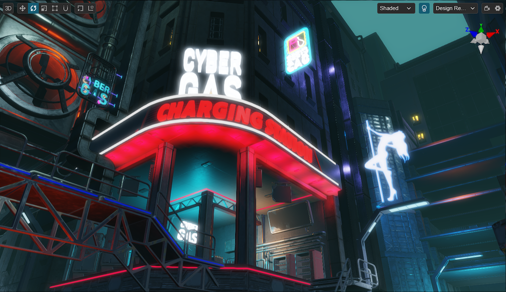
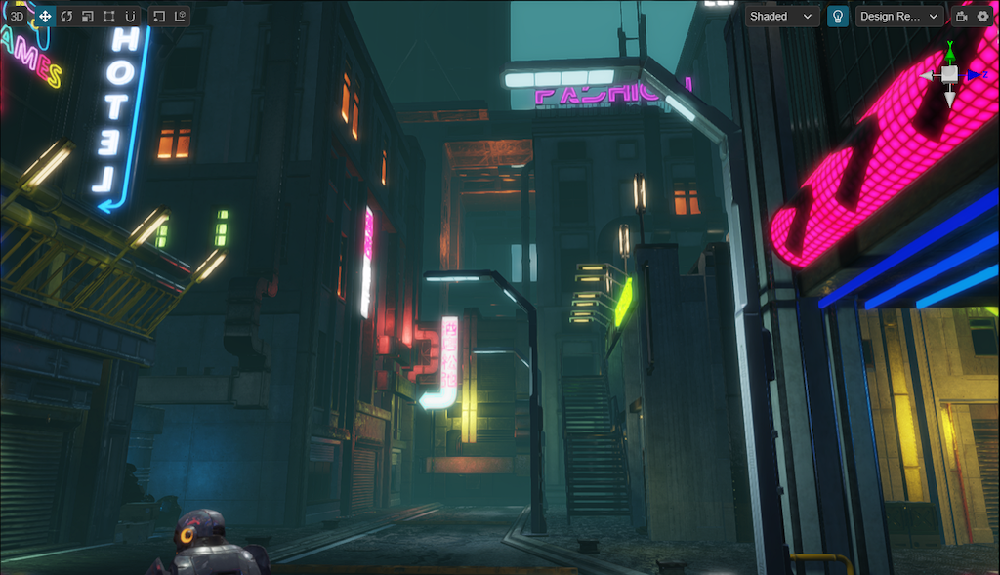
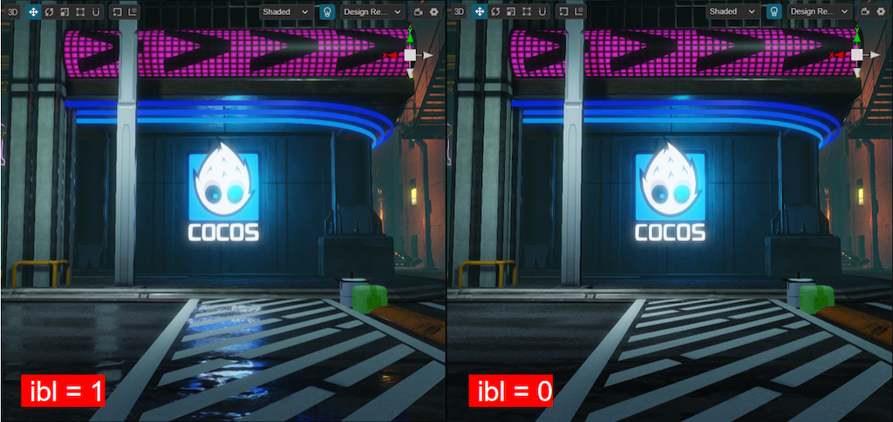
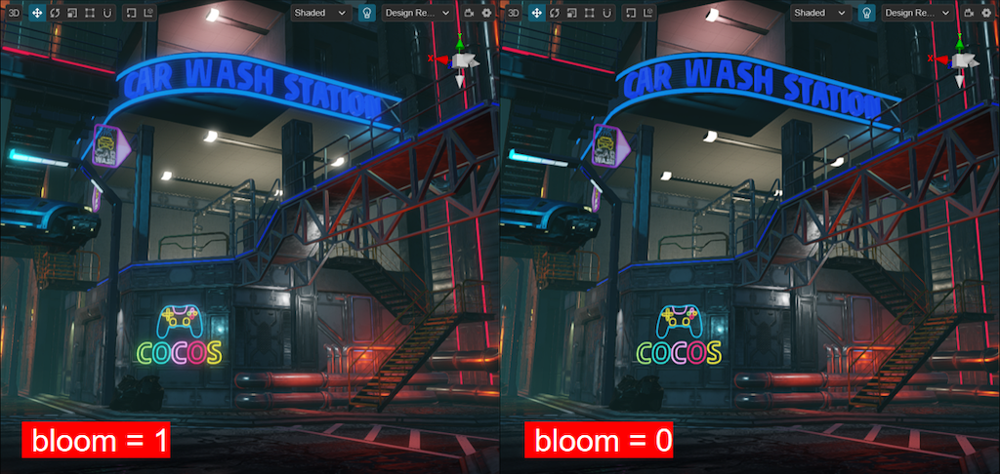
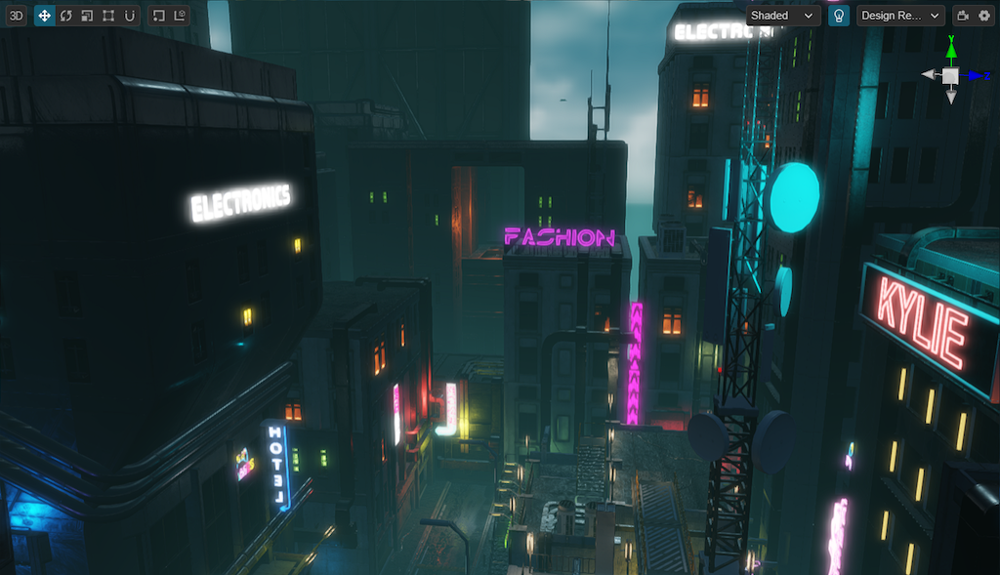

Cocos Cyberpunk 是 Cocos 引擎官方团队以展示引擎重度 3D 游戏制作能力，提升社区学习动力而推出的完整开源 TPS 3D游戏，支持 Web, IOS, Android 多端发布。

本系列文章将从各个方面对源码进行解读，提升大家的学习效率。希望能够帮助大家在 3D 游戏开发的路上更进一步。

工程源码免费下载页面:
[https://store.cocos.com/app/detail/4543](https://store.cocos.com/app/detail/4543)

## 开篇

>作为大型项目主程的核心技能之一，麒麟子推荐还没有掌握的同学赶紧补齐。

**“一顿操作猛如虎，一看帧率不到 5 ”。**

上面这句话虽然有些夸张，但却是大多数同学开发项目时的真实写照。

麒麟子其实很早就想写这个话题，但要讲清楚这个话题不能光凭嘴说，需要一个适合的大型项目来演示。

听到制作团队说，**Cocos Cyberpunk 原生版本**能够在 **小米6** 上跑 **30** 帧。我知道，分享这个话题的机会来了。

**感谢 Cocos Cyberpunk 制作团队，让我终于可以分享这个内容了。**

如今，我们可以看到常见的三种平台：**原生（鸿蒙/iOS/Android）**、**小游戏** 和 **H5**。

由于平台的差异性，同一个机型上，不同平台所能承载的游戏品质会也有很大差别。更不用说，不同水平的机型之间的差别了。

而 **Cocos Creator** 得益于它双核引擎的优势，很多用户就是冲着多端发布来的。

所以，隔三差五就会有人来问：**如何让自己的项目，在不同的平台都正常运行**。

今天麒麟子就来分享一下如何解决这类问题，并使用 **Cocos Cyberpunk** 作为案例讲解。

## 主要内容



有些问题看似复杂，但只要你看破了事情的本质，解决起来就会很容易。

其实核心思想是：**如何让你的程序在不同算力的平台、不同算力的设备上，运行流畅的同时，尽可能保留画质。**

在中低端机器上流畅运行，性能是优先需要考虑的，其次才是画质。 这是取舍，有所取，必然有所舍。

那具体如何做呢？

麒麟子在从业生涯中，处理过 10 多种不同类型的项目适配，总结下来就两个步骤：**先分类**、**再处理**。

接下来，让我们先看看本文的主要内容：

- **最佳机型设定**
- **机型分档方案**
- **性能适配策略**
- **Cocos Cyberpunk 中的方案**

这都 500 字了，内容看起来还是太抽象，我们直接进入主题吧。

## 最佳机型设定


在参与 **Cocos** 引擎生态建设这三年不到的时间里，麒麟子和队友们接触了 **2000** 多家国内外 **CP**，在 **最佳机型设定** 这个事情上，大致有三类：

### 1、以高配机型为目标机型

这类项目追求的是品质，通常项目规模较大，玩法复杂，画面精细。

### 2、以中配机型为目标机型

这类项目一般中规中矩，玩法、画质都比较普通。

### 3、以低配机型为目标机型

这类项目追求的是设备覆盖率，想要尽可能的覆盖更多机型。多数游戏是属于玩法创新，画面感人的品类。

**这三个策略，都有明显的短板：**

- 若以高配机型为主，则难以覆盖到中、低配机型玩家，导致收益下降。
- 若以中配为主，则难以覆盖到低配玩家，玩法和画质也难以满足高配玩家的需求，通常来说，收益是很差的。
- 若以低配为主，在设备覆盖率上占优势，但游戏创意如果没有形成爆款，也很难受到玩家青睐。

这也让多档机型性能适配这个工作显得尤为重要。

假如我们以高配机型为主，配合机型适配策略，就能解决上面的各类问题。

这里有一个问题就来了：**以哪一年的高配机型为主？**

麒麟子就不绕弯子了：**应该以项目上线时的高配旗舰机型为主**。

比如，你的项目今天立项，预计开发一年，那么你应该以一年后的机型为主。今年的旗舰机型，一年之后，会沦为中端机。

大家要记得：**所有未发生的事情，都应该考虑随着时间的推移可能发生的改变，不能用现在的数据去衡量。**

## 机型分档方案


如前面讲过，我们应该：**先分类**、**再处理**。

### 机型分档

根据手机芯片能力，将手机分为多档。 通常我们可以分为 3 档，如果有精力，也可以分为 4 档，不建议分得更多。

我们以 3 档为例：

#### 1、高档

高档机型，一般是游戏上线时，各大厂商发布的旗舰机型作为参考。

高档机型是最花时间的一档，因为当游戏运行一年后，高档机型也会变为中档。对高档机型的充分利用，也能尽可能延长游戏生命力。

高档机型的主要要求就是：效果全开的情况下运行流畅。

#### 2、中档

中档机型一般是游戏上线时，发布时间在 3 年左右的旗舰机作为参考。

中档机型的优化，更多是平衡。要求是保证运行流畅的情况下，效果尽可能好。

但由于中档机型在开发的时候就能拿到，所以中档机型的优化工作可以提前做，测试时间更长。

#### 3、低档

低档机型一般是游戏上线时，发布时间在6年左右的旗舰机作为参考。
低档机型只需要考虑运行性能，不需要的东西能关就关掉。

### 分档方法

#### 苹果设备

苹果设备的分类简单得想笑，只需要把苹果公司发布的所有产品，填入到对应的档位即可。

#### 其他设备

对于 **鸿蒙**、**Android**、**Windows** 或者其他系统的设备，检测方法就不能填表了，因为全世界那么多厂商，那么多设备，甚至还有一些组装机。

那有没有什么东西是可以列进表里的呢？

当然有，那就是芯片。

虽然全世界有非常多的设备厂商、非常多的品牌、非常多的系统。但是造芯片的，就只有那几家，而每年发布的芯片版本也是不多的。

因此，对于这类设备，我们的方法如下：

1. 把常见芯片填入到对应的高、中、低档表里
2. 程序启动时，检测设备的芯片型号
3. 根据芯片型号决定设备所属档位

> 如果不想单独处理苹果设备，也可以把苹果设备的芯片填表管理。 给予适合的分数就行。

#### 白名单

可能你有所不知，除了人的腰锥间盘，某些厂商做的设备也可能会非常突出。

比如，麒麟子曾经在做一个项目优化的时候， **机型A** 和 **机型B** 拥有同样的芯片，但 **机型A** 属于高端，**机型B** 却只能处于中端。

这种情况下，就需要一个白名单机制，白名单中的机型，直接采用白名单中配置好的机型档位。

这里还有另一种情况，某些厂商的某款手机，为了体现自己的超高性价比，会选择和某几款游戏合作，在操作系统端和游戏程序端双向奔赴，针对性进行优化。

这样明明是中端设备，却能将这款游戏跑出其他高端设备上才能拥有的效果。这种情况下，也需要白名单。

#### 未知机型

世界这么大，总有你没见过的设备。 这个时候，一律按低端处理就好了。

> 系统中，可以保留 **画质切换** 功能，让用户可以自行切换 高、中、低档配置。在出现未知设备时，或者用户有个人偏好时，能自行决定画质。

## 性能适配策略


### 性能适配 vs. 性能优化

性能适配只做一件事：关掉一些功能，直到帧率满足要求。

但不同档位的画面效果是设定好的，对于低端机来说，可以关闭所有效果，以求运行流畅（24~30 帧）。但对中端机来说，有一些效果就必须保留了，否则中端机的画质和用户体验难以保证。

所以，下面这两种情况发生时，需要做性能优化。

1. 中端机上某个效果必须保留
2. 关掉所有能关的效果，低端机依然达不到要求

由于本篇文章主要讲性能适配，就不再多讲性能优化了。 性能优化是一个很大的话题，涉及到方方面面以及项目本身。 

麒麟子之前有分享过一些关于图形渲染相关的优化，有兴趣的朋友可以翻看，这里就不再展开讲了。

### 常见技巧

所有的技巧，核心思路都是：**减少不必要的运算。在不影响功能的情况下，关闭更多细节。**

通常，渲染是游戏性能的主要开销，也是不影响游戏玩法的部分。

因此，机型性能适配建议优先从渲染入手。

#### 1.内容细节

不管是 **3D** 游戏还是 **2D** 游戏，场景、人物都可能由主体和细节构成，特别是场景。

可们可以对场景和人物的细节进行分类，在不影响功能的情况下，逐步关闭更多的细节。

比如，场景中有草和石子。 我们可以在高端机上显示所有的草和石子，在中端机上，减少一些。 在低端机上变得更少，或者干脆完全不显示。

#### 2.特效等级

不管是 **3D** 还是 **2D** 游戏，一个特效都可能由不同的元素组成。 可以将此元素按等级分类。 在配置越低的机器上，关掉更多的细节。

这样既保留了特效的存在，又提升了性能。

假如，一个火焰特效由 3 个发射器组成。 我们可以约定，高端机显示所有发射器， 中端机显示 2 个发射器， 低端机显示 1 个发射器。

#### 3.渲染分辨率

不管是 **3D** 还是 **2D** 游戏，渲染分辨率对游戏性能造成的开销是一样的。 所以，低端机上，可以考虑限制渲染分辨率来提升性能。

比如，现在许多手机用了高分屏， **DPR** 能达到 2 或者 3。 如果检测到它是低端机，可以限制 **DPR** 的最大值，这样创建出来的后台缓冲区就会很小。

如果不知道如何限制 **DPR**，最简单的做法就是将摄像机内容渲染到一张 **RenderTexture** 上。 **RenderTexture** 的大小是完全由你控制的，想要多小都可以。

#### 4.裁剪距离

**2D** 游戏不太可能用上，但对一些可以变换视角的 **3D** 游戏，可以通过缩短裁剪距离来减少渲染，提升运行性能。

#### 5.材质 LOD

材质复杂度直接依赖GPU的算力，我们可以制作出不同等级的材质，在高端机上使用最精细的材质，在中端机上使用减少了一些细节的材质，在低端机上使用最普通的材质。

#### 6. 模型 LOD

在 **3D** 游戏中，当上面的工作都做完后，还是无法达标时，可以考虑降低模型细节。

模型 **LOD** 不仅可以根据距离进行切换，也可以根据设备档次来切换。

如果系统中本身就已经拥有根据远近切换 **LOD** 的系统，只需要在不同设备上限制模型**LOD** 的最高等级就可以了。

比如我们可以设定，在低端机型上，从第三级开始。 这样 第一级和第二级的模型就不会被用上。 大大减少了模型渲染开销。

## Cyberpunk 中的方案

接下来，我们来看看 **Cocos Cyberpunk** 中的性能适配方案。

涉及到的大部分源码都在 **pipeline/settings** 目录。

### 默认配置

项目中，用于处理性能适配的代码在 **pipepline/settings/href-setting.ts** 中。

打开它，可以看到。有一个 **HrefSetting**， 它定义了所有与性能相关可以控制的标记。

```ts
export const HrefSetting = {
...
  shadingScale:1, //控制渲染分辨率的大小
  bloom:0, // Bloom 效果开关
  fps:60, //FPS 锁定
  transparent:1, // 是否渲染透明物体
  clusterLighting:1, //是否开启动态光源
  ibl:1, // 是否开启环境反射
  fsr:1, // 是否启用超分技术
  taa:1, // 是否开启 TAA 抗锯齿
  fxaa:1 // 是否开启 FXAA 抗锯齿
  sceneParticles: 1 //场景粒子特效开关
...
}
```

从上面的参数中我们可以看到，它们主要属于三类：

1、渲染分辨率：**shadingScale**, **fsr**

2、效果开关类：**bloom**, **ibl**, **taa**, **fxaa**

3、渲染裁剪：**transparent**, **clusterLighting**, **ceneParticles**

可以直接修改这个配置的值，然后到编辑器中去查看差异。 我们来看几组值：






### 调试参数

接下来可以看到一段代码：

```ts
if (!EDITOR) {
    let href = window && window.location && window.location.href;
    let settings = href.split('?')[1]
    if (settings) {
    ...
    }
}
```

这段代码是用作调试用的，方便大家在运行时快时开关各种效果。

只需要在预览时，在 **URL** 中添加对应参数就行，比如：

```ts
http://localhost:7456/?zoomScreen=1;
```

就是查看 **zoomScreen** 为 1 时的效果。 进入游戏，滚动鼠标滚轮，你会看到下面这样的效果：


### 获取 GPU 分档信息

向下看，可以看到有一个 getGpuInfo 函数，它负责获取设备的 GPU 信息， 并分档。

getGpuInfo 在 gpu.ts 文件中定义，它主要完成了两件事。

#### 1、获取 GPU 型号

Cocos Creator 引擎内置了获取 GPU 型号的方法：director.root.device.renderer。

它可以在所有 Cocos Creator 支持的平台上运行。

#### 2、GPU 打分

GPU 打分这里，分为了 **移动端** 和 **PC 端**。

**PC 端** 使用了 **pipeline/lib/detect-gpu** 库进行设备型号检测并给出分数，而移动端则直接使用 **gpu-mobiles.ts** 中的定义的分数。

```ts
export const GpuMobiles = {
    "adreno": {
        "530": 272,
        ...
        "619l": 252
    },
    "immortalis": {
        "g715": 3535
    },
    "apple": {
        "a16": 3331,
        ...
        "a10": 300
    },
    "mali": {
        "g710": 2319,
        ...
        "g72": 183
    },
    "xclipse": {
        "920": 1906
    }
}
```

可以看到，它定义了常见的移动端芯片分数。

当设备信息不在配置表中时，默认按低端机处理。

### 性能开关

在 **href-settting.ts** 中，定义了 **mobileSettings** 和 **pcSettings**。

可以看到，移动端分了 3 档，**PC端** 分了 4 档。每一档都指定了分数，以及需要关闭的效果。

每一档与上一档相比，是继承关系。 我们以 **mobileSettings** 为例。

```ts
let mobileSettings = [
    {
        score: 2000,
        shadingScale: Math.min(1240 / game.canvas.width, 1),
        bloom: 0,
        fxaa: 0
    },
    {
        score: 1200,
        shadingScale: Math.min(1024 / game.canvas.width, 1),
    },
    {
        score: 500,
        fsr: 0,
        taa: 0,
        maxEnemies: 2,
        sceneParticles: 0
    }
]
```

在移动端，最高档机型会：**限制渲染分辨率为 1240**、**关闭 bloom和fxaa**，第二档机型和第一档一样，但会限制最大渲染分辨率为 **1024**，以此类推。

### 平台差异

在 **href-setting.ts** 的最后几行，可以看到：

```ts
if (sys.isMobile && !JSB) {
    // todo: mobile particle rendering issue
    HrefSetting.transparent = 0
}
```

由于 **JSB** 是 **Cocos Creator** 引擎中，与原生平台通信的，!JSB 代表的就是非原生平台，即：小游戏 和 **H5**。

整个代码的意思就是，在非原生平台上，关闭半透明效果（粒子系统、透明物效等等）



## 总结

本篇文章中，麒麟子花了大量篇幅来讲解设备性能适配的方法和原理。这是因为，设备性能适配需要量体裁衣，根据自身项目需求制定最佳策略。

**Cocos Cyberpunk** 中的设备性能分档方案，可以作为一个基础的开始，大家可以根据自己的项目添加更多可控的细节。

希望这篇文章能给大家带来帮助，能够让大家在自我升级的道路上又跨出一大步。
