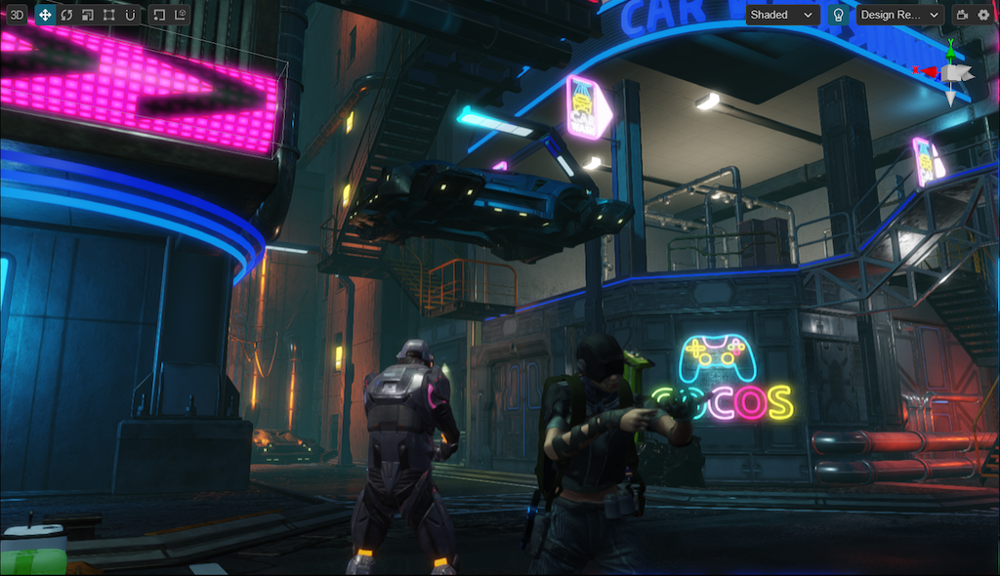
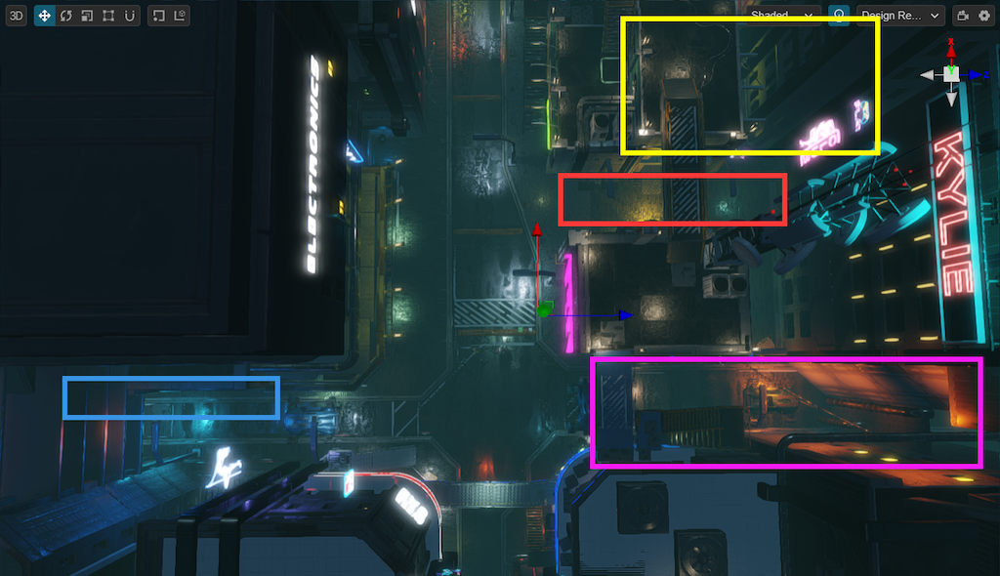
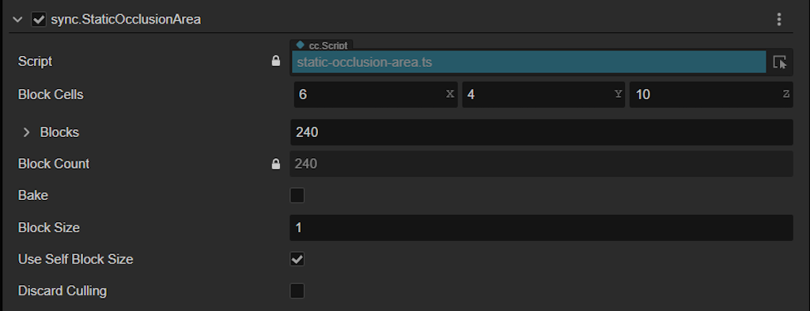
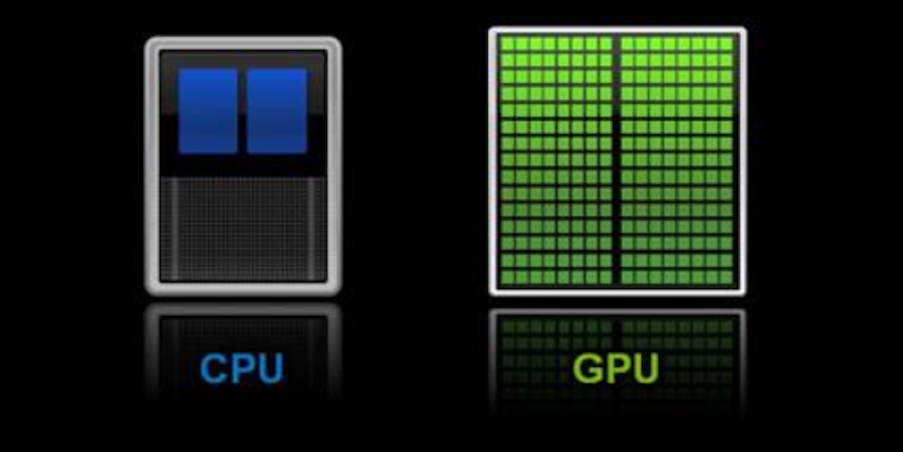

# Static-Occlusion-Culling, A great solution for improving culling performance during rendering



**The fastest way to render a model is not to render it at all.**

This article will delve into the principles and code of the static occlusion culling solution in Cocos Cyberpunk. This approach enables our games to efficiently eliminate unseen static objects during rendering, reducing the rendering load and enhancing game performance.

Cocos Cyberpunk is a complete open-source TPS 3D game developed by the Cocos Engine official team to showcase the engine's capabilities in creating heavy 3D games and to boost the community's learning motivation. It can be released to multi-platforms, such as Web, iOS, and Android.

This series of articles will analyze the source code from various perspectives to improve your learning efficiency. I hope to help you advance further in 3D game development.

Download the project source code for free at：
[https://store.cocos.com/app/detail/4543](https://store.cocos.com/app/detail/4543)

## Preface

In the previous article, I shared the Performance Scaling Solution in Cocos Cyberpunk, which can make your games run smoothly on high-end, mid-range, and low-end devices.

Many people are particularly curious about what optimization techniques can make this project run smoothly on older devices like the iPhone 7 and Xiaomi 6.

That brings us to a highly cost-effective rendering performance optimization solution called **（Static Occlusion Culling, SOC）** implemented in **Cocos Cyberpunk**.

**SOC** is a type of **Precomputed Visibility Culling (PVC)** implementation and has been a technique widely used in game development for over 20 years.

It is especially suitable for scenes with a high density of static models, such as the main city areas in games like **PUBG** and **Genshin Impact**.

Today, we will take a look at how **Cocos Cyberpunk** implements **Static Occlusion Culling(SOC)**. We hope that those in need can quickly apply it to their projects after reading this, significantly improving rendering performance.

## Draw Call and Culling

When it comes to rendering performance optimization, the first term that comes to mind is the **Draw Call**.

Many people, when optimizing performance, try their best to reduce **Draw Calls**, thinking that the fewer **Draw Calls**, the better. However, this is not always the case.

So, let's briefly discuss the underlying logic of **Draw Call** optimization.

In 2D projects, reducing **Draw Calls** does indeed improve performance in most cases. But in 3D projects, the situation becomes much more complex.

We need to understand the intrinsic logic of **Draw Call** optimization. Only by mastering this logic can we make informed decisions and strike the right balance when optimizing performance.

The reasons why **Draw Call** leads to performance overhead are as follows.

1. Too many **Draw Calls** can cause the **CPU** to assemble a large number of rendering instructions. When this exceeds a certain threshold, it leads to a bottleneck in communication between the CPU and GPU, affecting performance.

2. A high number of **Draw Calls** also reflects, to some extent, that there is too much content to render, which can put significant pressure on the GPU.

For the above two issues, there are two ways to optimize **Draw Call**.

1. **Merge multiple Draw Calls:** Static Batching, Dynamic Batching, GPU Instancing, etc., are all methods of combing draw calls.
2. **Cull unseen objects as early as possible：** There are mainly two situations, culling models outside the camera view and culling modes completely blocked by other models.

From the description, it's clear that culling unseen rendering objects is a method that can both reduce draw calls and lessen the GPU's rendering burden. After all, the fastest way to render a model is not to render it at all.

Therefore, when optimizing projects, we should prioritize culling unnecessary rendering objects. For objects that must be rendered, we can then use the draw-call merging method to optimize.

**Tips**：

Some people may not be able to distinguish between culling and clipping, here is a brief explanation.
**Culling**: Refers to discarding objects that do not meet certain conditions entirely.

**Clipping**: Refers to cutting off the parts that are outside the boundary, leaving only the parts inside the boundary.

## Occlusion Culling

Let's start with the following figure.


In the picture above, the green geometry represents what needs to be rendered, and the light green geometry represents what does not need to be rendered.

The circular geometry on the left is outside the camera's field of view and will be culled during the camera's frustum culling stage.

The triangular geometry on the right is obscured by the rectangle. If no special treatment is applied, it will not be culled.

To cull the triangle before submitting it for rendering, we need to use the Occlusion Culling(OC) technique.

For different situations and performance overheads, occlusion culling is divided into two main categories. real-time culling and offline culling.

For static scenes, the offline culling is sufficient and offers the best performance.

The essence of offline culling is: pre-baking scene visibility and quickly culling unseen models during rendering.

This optimization method based on offline preprocessing is called **Precomputed Visibility Culling** technique mentioned at the beginning of this article.



Taking the above image as an example, In the **Cocos Cyberpunk** project, when the camera is at the position indicated by the coordinates indicator, the models marked by the rectangles can't be seen due to being obscured by the buildings.

As long as we have a way to quickly determine which models can't be seen from the current camera position, we can hide them before submitting data for rendering, thereby reducing draw calls and lessening the GPU rendering burden.

Next, let's look at the specific implementation in **Cocos Cyberpunk**.

## SOC in Cocos Cyberpunk

In the **Cocos Cyberpunk** project, the **SOC**-related code is located in the **pipeline/components/occlusion-culling** folder.

### Implementation Overview

The **SOC** implemented in **Cocos Cyberpunk** mainly contains the following steps.

1. Mark the areas that need to be processed.
2. （Baking）Divide the area into a certain number of culling blocks, and use the ray searching algorithm to pre-record the visible models of different blocks in the editor.
3. Calculate the culling block where the camera is located based on its position during rendering.
4. If the camera is in a culling block, access the list of seeable models and submit to render.
5. If the camera is not in a culling block, follow the default rendering process.

### sync.StaticOcclusionCulling Component

Open the **assets/scene** in the  **Cocos Cyberpunk** project, and you can find a node named **static-occlusion-culling** in the Hierarchy.


On the Inspector panel, you can see that it has a 
**sync.StaticOcclusionCulling** component.

The most important parameters of this component are.

1. **Root**: the scene root
2. **Block Size**: default block size
3. **Bake**: Click to bake
4. **Stop**: Stop baking
5. **Render Blocks**: Whether to display the culling blocks
6. **Enabled Culling**: Whether to enable culling
7. **Use Gpu**: Whether to using GPU during baking
8. **Should Fast Bake**: Whether to use the fast baking method （default is **NO**）
9. **Sphere Bake Count**: How many rays are used when using the fast baking method. (the more rays, the more accurate and the more time-consuming)

### sync.StaticOcclusionArea Component

Expanding this node, you can find many child nodes named **static-occlusion-area-xxx** under it.

All of these nodes make up the occlusion culling areas in the project, as shown by the black cubes in the image below.


Select one of the nodes and adjust its **scale** property to change the size of the culling area.

In the node's Inspector panel, you can see a **sync.StaticOcclusionArea** component.



Expanding the **Blocks** property, you can see the content shown in the image below.


Among these properties, **Block Cells**, **Blocks**, and **Block Count** are automatically generated and do not need any manual modification.

The other operable properties are as follows.

- **Block Size**: The size of the current culling block.
- **Use Self Block Size**: When enabled, it will use the **BlockSize** on this component, otherwise it will use the default value defined in the **sync.StaticOcclusionCulling**  component.
- **Discard Culling**: When enabled, no culling operation will be performed when the camera enters this area, and all objects will be treated as visible.
- **Bake**: Click to bake.

### Baking Implementation

In the **StaticOcclusionCulling** class, the **_startBake** method contains the main logic of baking.

When the **bake** property on the component is clicked, the **_startBake** method will be called.

```ts
@property
get bake () {
    return false;
}
set bake (v) {
    this._startBake();
}
```

> This is also a commonly used trick, combined with the @executeInEditMode decorator, you can make a property act as a button.

In the **_startBake** method, get all the **MeshRenderer** under the root node, obtain the model data, and the baking.

The baking operation mainly has two steps.

1. In each culling block, emit enough rays
2. The ID of the model hit by the ray will be added to the visible list of the current culling block.

### Ray Generation

In this algorithm, the way of ray generation determines the baking quality. There are two methods implemented in Cocos Cyberpunk.

- **Spherical random rays**:  Generate rays in different directions randomly according to the number specified by the **Sphere Bake Count** property.
- **Model vertex rays**: Traverse all vertices of the models in the scene, and generate one ray for each vertex.

The **shouldFastBake** in the Inspector panel is used to decide which method to use.

```ts
if (this.shouldFastBack) {
    this._bakingDirections = sphereDirections(this.sphereBakeCount);
}
else {
    this._bakingDirections = modelPoints(this.models);
}
```

### Baking with GPU



Cocos Cyberpunk uses gpu.js to accelerate the baking tasks.

As a result, developers with better graphics cards will have higher baking efficiency and shorter baking time.

**gpu.js** is an open-source library that can be used in web and node environments for general-purpose GPU computing. If you are interested, you can get more detail at: [https://github.com/gpujs/gpu.js](https://github.com/gpujs/gpu.js).

When the baking is started, the data will be packed and sent to the GPU. After the GPU computation is completed, the result will be obtained and processed. For specific implementation detail, please refer to the `raycast-gpu.ts`.

### Culling

In the  **StaticOcclusionCulling** class, the **calcCulling** method implements the main logic of occlusion culling.

It has a very simple logic, it just calculates which block the camera is in, and then sets the visible property of models to true.

> **Tips:** In order to preview in the editor, the code for baking and culling are shared in the same ts file.

- The @executeInEditMode is used in the class declaration of a component, indicating that this component will be executed in the editor.
- In the code, **if(EDITOR)** is used to justify the type of runtime environment.

## Possible Improvements


As mentioned at the beginning of the article. PVC has been used for more than 20 years in game development. The SOC implemented in Cocos Cyberpunk is just one of them.

Since it only records the ID of seeable objects in the space, it can only be applied to the culling of static objects.

To cull movable objects, you can use a similar technique named **Portal Visibility System(PVS)**.

The difference between **SOC** and **PVS** is that in PVS, the culling blocks no longer store the ID of models, but the ID of other seeable culling blocks.

Combined with the octree scene management, movable objects can efficiently update their culling block, and the camera just needs to render the objects in the seeable culling blocks.  

## Conclusion

As hardware advances and the requirements of users increase, we always want to maximize the potential of devices' power.

Therefore, performance optimization has become an enduring and ever-relevant topic.

Although 3D is only 1D more than 2D, the amount of knowledge to master and the number of problems to face is more than 10 times greater.

It is precisely because there are so many problems to overcome that game development is so interesting.

I hope this article can help you open a window in terms of rendering performance optimization for your projects.

Remember: **The fastest way to render a model is not to render it at all**
