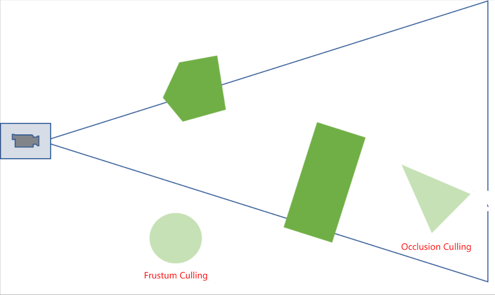
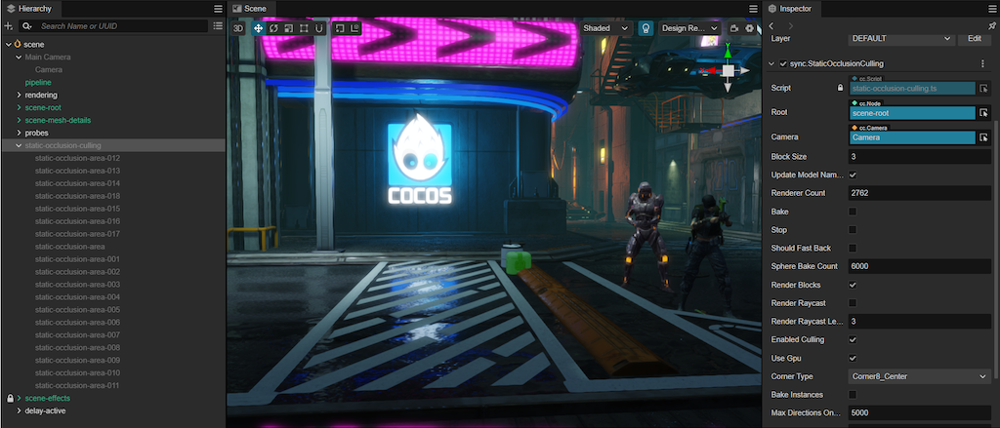
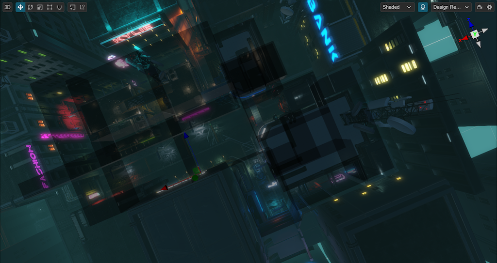
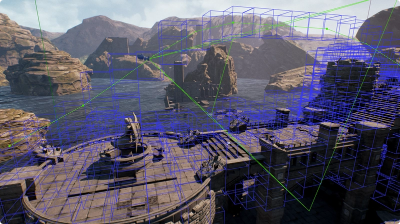

#


**一个模型最快的渲染方式就是让它不渲染！**

本文将从原理和代码角度讲解 Cocos Cyberpunk 中的静态遮挡剔除方案，它可以使得我们的游戏在渲染的时候，以很少的开销剔除看不见的静态对象，减少渲染负担，提升游戏性能。

Cocos Cyberpunk 是 Cocos 引擎官方团队以展示引擎重度 3D 游戏制作能力，提升社区学习动力而推出的完整开源 TPS 3D游戏，支持 Web, IOS, Android 多端发布。

本系列文章将从各个方面对源码进行解读，提升大家的学习效率。希望能够帮助大家在 3D 游戏开发的路上更进一步。

工程源码免费下载页面:
[https://store.cocos.com/app/detail/4543](https://store.cocos.com/app/detail/4543)

## 你们要的干货

上一篇文章中，麒麟子给大家分享了 **Cocos Cyberpunk** 项目中的**高、中、低端机型适配方案**。

很多朋友就特别好奇，是什么优化手段能够让这个项目在 **iPhone 7** 和 **小米 6** 这样的老年机上也能健步如飞的。

那就不得不提，**Cocos Cyberpunk** 中实现的一个性价比超高的渲染性能优化方案：**静态遮挡剔除（Static Occlusion Culling，SOC）**。

**SOC** 属于 **预计算遮挡剔除（Precomputed Visibility Culling, PVC）** 的一种实现，已经是一个使用了 20 多年的技术。

它特别适合静态模型密集的场景，比如吃鸡、原神等游戏中的主城区域。

今天我们就来看看 **Cocos Cyberpunk** 中是如何实现 **静态遮挡剔除（SOC）** 的，希望有需要的朋友看完后，能够快速的将它用在自己的项目中，大幅提升渲染性能。

## Draw Call 与 Culling

一说到渲染性能优化，我们脑海中率先浮现出来的词语就是 **Draw Call**。

很多人在做性能优化时，会想尽办法去减少 **Draw Call**，以为 **Draw Call** 越少越好，其实不然。

所以这里简单讲讲 **Draw Call** 优化的内在逻辑。

在 **2D** 项目中，大部分情况下，减少 **Draw Call** 确实能提升性能。 但在 **3D** 项目中，情况变得复杂许多。

这就需要我们明白 **Draw Call** 优化的内在逻辑，只有掌握了这个逻辑，才能在做性能优化时做到游刃有余、取舍有度。

**Draw Call** 导致性能开销的原因：

1. **Draw Call** 过多会导致 **CPU** 需要组装很多渲染指令，当超过一定数量后，会导致 **CPU** 与 **GPU** 通信出现瓶颈，影响性能。

2. **Draw Call** 过多，也一定程度上反映了需要渲染的内容过多，也会给 **GPU** 造成较大压力。

针对以上两个问题，**Draw Call** 的优化有两种方式：

1. **将多个 Draw Call 合并：** Static Batching, Dynamic Batching, GPU Instancing 等都是 Draw Call 合并。
2. **尽早剔除掉不需要渲染的对象：** 主要有两种情况，剔除摄像机外的模型、剔除被其他模型完全挡住的模型

从描述就可以看出，**剔除不需要的渲染对象**是既能减少 DrawCall，又能减少GPU渲染负担的方法，毕竟：**一个模型最快的渲染方式就是让它不渲染！**

因此，在做项目优化时，我们应该优先剔除不需要渲染的对象。 在必须要渲染的对象中，再用 **Draw Call** 合并的方法去优化。

>**小知识**：有朋友分不清**剔除(Culling)**和**裁剪（Clipping）**的区别，这里科普一下。<br>**剔除**：是指将不符合条件的对象**整个**丢弃。
<br>**裁剪**：是指将超出边界的**部分**裁掉，只留边界内的**部分**。

## 遮挡剔除（OC）

我们先看一张图：



上图中，绿色几何体表示需要渲染，浅绿色几何体表示不需要渲染。

左边圆型几何体，处于摄像机视野外，会在摄像机视锥体剔除阶段被剔除。

右边三角形几何体被长方形遮挡，如果不做特殊处理，是不会被剔除的。

如果想要在提交渲染前剔除掉三角形，就需要用到 **遮挡剔除** (**Occlusion Culling, OC**) 技术。

而针对不同的情况和性能开销，遮挡剔除又分为了实时剔除和离线剔除两个大类。

对于静态场景，离线剔除就足够了，并且也是性能最强的。

离线剔除的本质就是：**预先存储场景可见性，在渲染时能快速访问并隐藏不可见的模型**。

这种基于离线预处理的优化手法，就是本文开头讲到过的 **预计算遮挡剔除**（**Precomputed Visibility System**）技术。


我们以上图为例，在 **Cocos Cyberpunk** 中，当摄像机处于坐标指示器位置时，由于被建筑物遮挡，图中长方形标注的区域的模型是看不见的。

只要我们有办法快速判断当前摄像机位置哪些模型看不见，就能够在提交渲染前隐藏它们，从而减少 **Draw Call**，减轻 **GPU** 渲染负担。

接下来，我们看看 **Cocos Cyerpunk** 中的具体实现方案。

## 方案细节

在 **Cocos Cyberpunk** 项目中，与 **SOC** 相关的代码在 **pipeline/components/occlusion-culling** 目录下。

### 方案概述

**Cocos Cyberpunk** 中实现的 **SOC** 总共分为以下几步：

1. 标记出需要处理的区域
2. （烘焙）将区域分成剔除区块（Block），在编辑器中采用查询算法，提前记录好不同区块中可以看到的模型。
3. 渲染时，根据摄像机位置计算出处于哪一个剔除区块
4. 如果处于剔除区块，则取出对应区块中可见的对象列表，并标记为可见。
5. 如果不处于剔除区块，则不做任何处理，按引擎默认流程执行

### sync.StaticOcclusionCulling 组件

打开 **Cocos Cyberpunk** 项目中的 **assets/scene** 场景，我们可以在场景节点中找到一个名叫 **static-occlusion-culling** 的节点。



在右边的属性面板上可以看到它有一个 **sync.StaticOcclusionCulling** 组件。

这个组件中需要特别关注的参数如下：

1. **Root**：场景根节点
2. **Block Size**：默认的区块大小
3. **Bake**：点击后会进行烘焙操作，生成可见性数据。注意：慎点，会花较长时间
4. **Stop**：停止烘焙操作
5. **Render Blocks**：是否显示剔除区块
6. **Enabled Culling**：是否启动剔除
7. **Use Gpu**：烘焙时是否使用 GPU
8. **Should Fast Bake**：是否使用快速烘焙方式（默认为：**否**）
9. **Sphere Bake Count**：使用快速烘焙方式时，生成多少根射线（射线越多，越精准，耗时越长）

### sync.StaticOcclusionArea 组件

展开这个节点，可以发现这个节点下有许多 **static-occlusion-area-xxx** 子节点。

所有的这些节点构成了项目中的遮挡剔除区域。 如下图中黑色立方体所示：



选择其中一个节点，调节它的 **scale** 属性就可以改变剔除区域大小。

在节点的属性面板中可以看到一个 **sync.StaticOcclusionArea** 组件。


展开 **Blocks** 属性可以看到下图所示的内容。


在这些属性中， **Block Cells**, **Blocks**, **Block Count** 都是自动生成的，不需要手工修改。

其余可操作的属性如下：

- **Block Size**：当前区块的大小
- **Use Self Block Size**： 开启后，会使用本组件上的 **BlockSize**，否则会使用 **sync.StaticOcclusionCulling** 组件中定义的默认值
- **Discard Culling**：开启后，摄像机进入此区域时，不会进行剔除计算，所有对象都可见。
- **Bake**：烘焙当前区块。这个也慎点，需要不少时间。

### 烘焙实现

在 **StaticOcclusionCulling** 类中， **_startBake** 就是烘焙的主要逻辑。

当组件上的 **bake** 属性被点击时，它会被调用。

```ts
@property
get bake () {
    return false;
}
set bake (v) {
    this._startBake();
}
```

> 这也是一个常用小技巧，配合 @executeInEditMode 就可以实现属性面板中的按钮功能

在 **_startBake** 函数中，先获取了 **root** 节点下所有的 **MeshRenderer**，拿到模型数据，然后进行烘焙。

烘焙时的操作主要分为两步：

1. 在每一个剔除区块（Block）中，向外发射足够多的射线
2. 射线射中的模型 ID ,会被加入到当前区块（Block）的可见列表中

### 射线生成

在这个算法中，射线的生成方式决定了质量，Cocos Cyberpunk 中实现了两种烘焙方式：

- **球型随机射线**：根据 Sphere Bake Count 参数指定的数量，随机生成不同方向的射线。
- **模型顶点射线**：遍历场景中所有顶点，每一个顶点生成一根射线

属性面板上的 **shouldFastBake** 用于决定使用哪一种方式：

```ts
if (this.shouldFastBack) {
    this._bakingDirections = sphereDirections(this.sphereBakeCount);
}
else {
    this._bakingDirections = modelPoints(this.models);
}
```

### GPU 烘焙


项目中使用了 **gpu.js** 对烘焙任务进行加速。

因此，显卡越好的朋友，烘焙效率会更高，需要的时间会更短。

**gpu.js** 是一个可以在 web 和 node 环境下利用 GPU 进行通用计算的开源库，有兴趣的朋友可以自行查看 [https://github.com/gpujs/gpu.js](https://github.com/gpujs/gpu.js)。

当静态遮挡烘焙启动时，会将数据打包并传给 GPU，待GPU运算完成后，拿到结果再处理。具体实现可以查看 **raycast-gpu.ts** 文件。

### 遮挡查询

在 **StaticOcclusionCulling** 类中， **calcCulling** 方法实现了遮挡查询的主要逻辑。

它的逻辑非常简单，只是计算出当前摄像机处于哪一个区块，然后把区块的可见对象的渲染标记设置为 **true**。

> **友情提示：**为了在编辑器中也能看到预览效果，项目中负责烘焙的代码和运行时代码是共用的。

- 在组件的类名声明处，用了 @executeInEditMode 标记这个类会在编辑器中执行。
- 在类的声明中，使用了 **if(EDITOR)** 来判断运行环境

## 可能的改进



如文章开头所述，**PVC** 已经是一个使用了 20 多年的技术。**Cocos Cyberpunk** 中实现的 **SOC** 只是其中一种。

由于它仅仅是记录了空间中可见物体的 **ID**，因此只能适用于静态物体的剔除。

如果需要对可移动的物体进行剔除，可以使用类似 **Portal Visibility System, PVS** 的技术。

与 **SOC** 的差别是，**PVS** 中的区块，存的不再是对象 **ID**, 存的是另一个区块的可见性。

配合八叉树场景管理，移动的物体实时更新自己所处的区块位置，摄像机只需要拿到可见区块列表，并渲染可见区块中的动态物体即可。

## 写在最后

硬件在发展，需求也在提升，为了发挥出设备的最大潜力，我们总是想榨干机器算力。

因此，性能优化也成为了一个经久不衰退的话题。

3D 虽然只比 2D 多了 1D，需要掌握的知识和面临的问题数量却不止 10 倍的差异。

也正因为有如此多的需要去克服的问题，才让游戏开发这么有趣。

希望这篇文章能够帮助到大家，在项目渲染性能优化方面打开一扇窗。

记住：**一个模型最快的渲染方式就是让它不渲染！**
