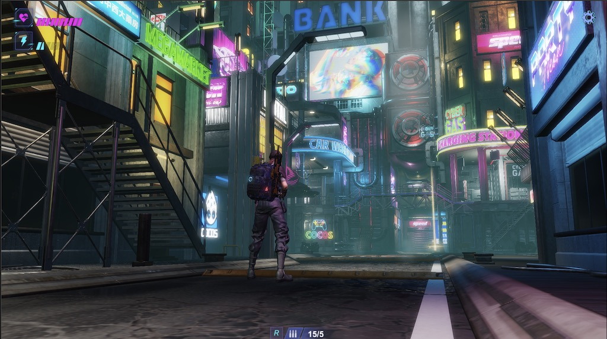
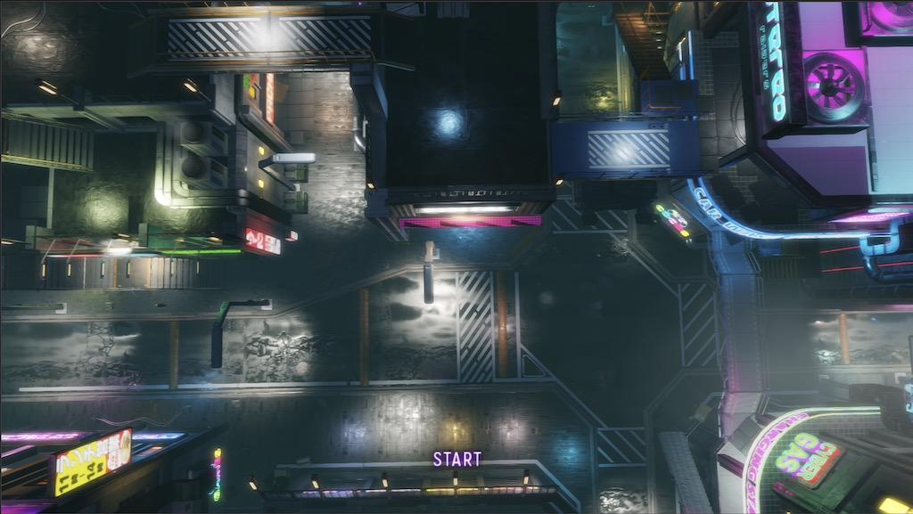

#


本文将会从原理以及实现细节、常见问题以及处理办法，内存开销以及兼容性等各方面，深入讲解延迟渲染技术。

Cocos Cyberpunk 是 Cocos 引擎官方团队以展示引擎重度 3D 游戏制作能力，提升社区学习动力而推出的完整开源 TPS 3D游戏，支持 Web, IOS, Android 多端发布。

本系列文章将从各个方面对源码进行解读，提升大家的学习效率。希望能够帮助大家在 3D 游戏开发的路上更进一步。

工程源码免费下载页面:
[https://store.cocos.com/app/detail/4543](https://store.cocos.com/app/detail/4543)

## 主要内容

虽然延迟渲染技术在 2004 年的 GDC 上被正式提出，已经过去了近二十年，但还是有大部分朋友并不知道其中的细节，特别是一些新接触 3D 编程的朋友。

本文虽然不长，但会言简意赅地讲清楚几个内容：

1. 延迟渲染技术**参与的渲染环节**
2. 延迟渲染技术**解决了哪些问题**
3. 延迟渲染技术**原理浅析**
4. Cocos Cyberpunk 中的延迟渲染管线**实现细节**
5. 延迟渲染技术 **内存、兼容性、GPU硬件参数**
6. 透明渲染解决办法

> **to 新朋友**： Cocos Cyberpunk 是 Cocos 引擎官方团队以展示引擎重度 3D 游戏制作能力，提升社区学习动力而推出的完整开源 TPS 3D游戏，支持 Web, IOS, Android 多端发布。
<br> 点击 **阅读原文** 可进入工程源码免费下载页面。

网上有很多关于前向渲染和延迟渲染的对比图、流程图。

但都有几个十分严重的问题，导致看了等于没看。

1. 过于学术，用词高端，却晦涩难懂
2. 没有讲清楚延迟渲染技术的工作边界，让人误以为延迟渲染能解决所有问题
3. 没有结合实际案例，导致看完就忘、学完就废。

麒麟子今天尝试用简单直白的方式，结合 **Cocos Cyberpunk** 开源项目源码，把它讲明白。



>再次感谢 **Cocos Cyberpunk** 制作团队，如果没有这个开源项目，我也没有工程级别的案例来分享这个话题。

## 参与环节

想要弄明白一个技术的原理，就需要弄明白它所参与的环节，为什么而出现。

才能知道它的工作边界，进而判断出适宜的应用场合，避免滥用。

讲延迟渲染的文章很多，但很少有人提及，在整个渲染流程中，延迟渲染所参与的具体环节。

**你以为延迟渲染无所不能，实际上它只参与了一小部分。**

接下来，让我们先来看看引擎中常见的 3D 渲染流程：**阴影贴图渲染** --> **主场景渲染** --> **屏幕后效渲染** --> **2D&UI 渲染**。

### 1. 阴影贴图渲染

这个阶段会把场景中所有物体，采用统一的材质生渲染一遍，生成阴影贴图，供下一个阶段渲染时使用。

### 2. 场景渲染

这个阶段就是正常的渲染阶段，会渲染场景中所有的物体，会使用阴影贴图产生阴影，会进行光照计算，产生各种质感。
场景中的物体可以分为两大类：**不透明物体**和**半透明物体**，它们的处理方式不一样。

### 3. 基于屏幕空间的效果渲染

这个阶段会利用适合的图像算法，对渲染出来的场景内容做一些特殊处理，提升画面效果。

### 4. 2D/UI 渲染

一些不随摄像机变化的 2D 元素，UI元素会在这个阶段渲染。

上面只是关键的标准渲染流程，某些项目会根据需求进行定制，增加一些特殊用途的渲染流程。

在如此长的渲染流程中，**延迟渲染主要针对的是场景渲染流程中的不透明物体。**

其余部分的工作在前向渲染和延迟渲染管线中几乎用的是同一套，并没有太多区别。

是不是和想象中的不一样？

那么接下来，我们看看它为什么而生。

## 前向渲染的问题

> 接下来的讨论，都只针对**场景渲染**流程，因为延迟渲染只参与到这一个部分。


在上面的场景中，有以下内容：

- **10 个模型（1 个平面，9 个立方体）**
- **7 个光源（1个平行光，7个球型光）**

如何采用前向渲染的话，流程如下：

1. 取得一个模型，提交给显卡渲染
2. 在 Vertex Shader 中处理顶点变换、UV等内容
3. 在 Fragment Shader 中，依次用 7 个光源进行光照计算
4. 处理下一个模型

我们可以很容易看出来，上面的这个流程，要走 10 次（因为有 10 个模型），并且每个模型需要与 7 个光源进行光照计算。

那整个光照运算就需要做 **10 * 7 = 70** 次。

它主要会产生两个问题：

### 1、Shader 指令限制

只能支持一定数量的灯光数量。当灯光数量超过一定值的时候，要采用多次绘制才能完成光照计算。

### 2、浪费 GPU 算力

光照计算是渲染中开销最大的部分，特别是 PBR 材质。

在上面的渲染过程中，有一些模型被遮挡的部分最终是看不见的，但依然会参与光照计算，这就造成了浪费。

想象一下，如果场景很大，有非常多的模型和光源，这两个问题得多严重啊。

延迟渲染的出现，刚好解决了这两个问题。

下面我们一起从延迟渲染的原理来看看，为什么它擅长解决这两个问题。

## 延迟渲染浅析



### 只需要两步

#### 1、准备阶段（几何体渲染）

这个阶段，会先将模型的用于计算光照所需的基本信息渲染到不同的 RenderTexture 中存储起来，比如：世界空间的位置信息、法线信息、颜色信息、深度信息 等等。

#### 2、光照阶段

光照阶段，顾名思义，就是利用上一阶段渲染出来的那些 RenderTexture，结合场景中的光照数据，计算出像素的最终颜色值。

可以看出，像素的颜色计算是统一放在第二阶段进行的，这就是延迟渲染中的延迟的由来。

由于像素的颜色计算统一放在了第二阶段，那些被遮挡的模型部分的像素已经被深度测试剔除了，极大地避免了不必要的运算，从而提升性能。

### GBuffer


#### GBuffer的定义

延迟渲染技术中，最重要的一个概念就是：**GBuffer**。

GBuffer 是 Geometry Buffer 的简称，意思是存储了几何体信息的缓冲区。 更具体一点，就是上面我们提到过的，在几何体渲染阶段用于描述物体位置、法线、颜色等信息的 RenderTexture 组合。

因此，上面提到的几何体渲染阶段，通常也叫：**GBuffer 阶段**

值得说明的是，延迟渲染只是一种思想，有很多不同版本的实现。GBuffer 中的 RenderTexture 具体存放什么，并不是统一的。

引擎工程师在实现延迟渲染管线时，会根据需求选择适合的组合。

#### GBuffer内容构成

想要完成光照计算，一些基础信息是必须的。比如：

- **世界空间的位置信息**
- **世界空间的法线信息**
- **物体表面颜色信息**

但除此之外，还需要什么呢？

由于 GBuffer 主要为光照计算提供必要的信息，要弄清楚 GBuffer 的内容，就必须了解一下光照计算相关内容。

光照计算是 3D 图形渲染的核心问题，大部分图形渲染的研究，都是围绕着光照计算进行的，无法用一两个段落就讲明白。

但如果只是为了让大家更好地理解 GBuffer，只需要了解概念就行。

不管是 **Blinn-Phong**， 还是 **PBR**，都遵守最基本的光照公式：

**物体最终颜色 = 环境光+漫反射+镜面反射+自发光**

只是二者在处理这四个部分的计算时，采用的数据和运算方法不同。

**环境光**：Blinn-Phong 中，是一个常数； PBR 中，由受模型材质参数影响。

**漫反射**：由模型材质、光照参数决定。

**镜面反射**：由模型材质参数、光照参数和观察位置决定

**自发光**：由模型材质中的 Emissive 相关参数决定。

在 Blinn-Phong 中，采用的公式都非常简单，大部分由常数和简单的向量运算公式构成。 

但在 PBR 中，使用的光照计算公式就非常复杂了，比如会用 **Cook-Torrance BRDF** 模型计算物体的漫反射和镜面反射。环境光则被细分为了环境漫反射和环镜镜面反射，使用 IBL 来处理。

现代引擎中，PBR 材质已经成为内置的首选材质，因此在现代引擎的 GBuffer 中，至少还会包含以下几个信息：

**1、环境遮蔽（AO）**

用于光照计算阶段参与到模型的漫反射。

**2、roughness/metallic**

PBR 也不只一种模型，为了简单起见，本文以 Cocos Creator 中采用的 roughness/metallic 模型为例

**3、Emissive**

物体自发光参数，在光照计算中，只是简单的相加。 它更大的作用是可以用来形成物体辉光效果，比如霓虹灯光。

### 多渲染目标（MRT）

上面提到的，GBuffer 由一堆 RenderTexture 构成，保存了用于光照计算的信息，如位置、法线、颜色、材质参数等等。

那这么多 RenderTexture，我们怎么获取呢?

一个最简单的办法，就是渲染多次场景，每一次渲染输出不同的内容到对应的 RenderTexture 就可以啦。

但这个方法，一听就不靠谱。 场景渲染几次，等于 DrawCall 翻了几倍，不管是 CPU 还是 GPU 压力都倍增。

那就不得不提到一个十分重要的显卡特性：**多渲染目标**

多渲染目标的英文叫 Mutiple Render Targets， 简称 MRT。这就是延迟管线技术得以应用的基础。

在图形管线中，我们把屏幕帧缓冲区和以及渲染纹理，都统称为**渲染目标**。

在常规渲染流程中，不管我们是把场景内容渲染到屏幕还是渲染到纹理，都只需要渲染到一个渲染目标。

但随着各类渲染需求的出现，显卡也逐渐支持在渲染内容时，同时渲染到多个渲染目标。

有了多渲染目标的支持，我们就可以在一次绘制时填充完所有 GBuffer 中的 RenderTexture。

### GBuffer压缩

从上面的描述中，我们可以看出。在基于 PBR 的延迟渲染管线中，GBuffer 至少要能包含以下信息：

除了上面说的 **AO**、**roughness**、**metallic**、**Emissive** 外。

- **位置**：vec3，高精度，分量范围不可预估
- **法线**：vec3，高精度，分量范围 0.0 ~ 1.0
- **颜色**：vec3，低精度，分量范围 0.0 ~ 1.0
- **AO**：float，取值范围 0.0 ~ 1.0
- **roughness**：float，取值范围 0.0 ~ 1.0
- **metallic**：float，取值范围 0.0 ~ 1.0
- **Emissive**：vec3，分量范围 不可预估
- **深度**：d24s8, 分量范围 0.0 ~ 1.0

依靠图形 API 和显卡特性，深度图可以直接获取，不需要自己再手动处理。

那即使我们把 AO|roughness|metallic 这三个 PBR 参数装到一张 RenderTexture 里，也还需要 5 张 RenderTexture（位置、法线、颜色、PBR、Emissive）才能满足需求。

但在当前的图形 API 标准中，OpenGL ES 3.0 也只规定了 GL_MAX_COLOR_ATTACHMENTS 不小于 4。 

也就是说，在移动端设备上，多重渲染目标（MRT）大于 4 的情况，兼容性会非常不好。

我们需要想办法压缩一下数据，让它只使用 4 张 RenderTexture。

由于法线是可以归一化的，只要我们知道归一化的法线的两个分量，就能计算出第三个分量。 这样一来，法线就只需要两个通道。 结合每个数据的取值范围，经过整理，我们可以得到下面这样的 GBuffer：

- **GBuffer_slot0**：RGBA8
  - xyz -> albedo.rgb
  - w -> 空闲
- **GBuffer_slot1**：RGBA16F
  - xy -> normal.xy
  - z -> roughness
  - w -> metallic
- **GBuffer_slot2**：RGBA16F
  - xyz -> emissive
  - w -> ao
- **GBuffer_slot3**：RGBA16F
  - xyz -> position.xyz
  - w -> 空闲
  
当然，还有一个隐藏的 GBuffer_slot4：D24S8，用于深度图。但它是深度缓冲区自带的特性，不占用 MRT 数量。

## Cocos Cyberpunk


早在 **Cocos Creator v3.1** 版本中，就提供了**延迟渲染管线** (**Deferred Rendering Pipeline**) 可供选择。

而在 **Cocos Cyberpunk** 项目中，依靠 **Cocos Creator 3.7** 全新的自定义管线能力，制作组也针对项目需求，实现了一套定制版的延迟渲染管线。

接下来，麒麟子就结合 Cocos Cyberpunk 源码，管线流程、GBuffer 构造与填充 和 光照计算 三个方面来展示一个实际的延迟渲染管线的实现细节。
> Cocos Cyberpunk 完整项目源码可以从 [https://store.cocos.com/app/detail/4543](https://store.cocos.com/app/detail/4543) 免费获取。

按照之前文章中讲过的方法，打开 Custom Render Pipeline Graph 窗口，可以在 main 管线中，找到 **DeferredBufferPass** 和 **DeferredLightingPass**。


### GBuffer构造

打开 deferred-gbuffer-pass.ts 文件，找到 DeferredGBufferPass 类。

```ts
const colFormat = Format.RGBA16F;
let posFormat = colFormat;
if (!sys.isMobile) {
    posFormat = Format.RGBA32F
}
passUtils.addRasterPass(width, height, 'default', `${slot0}_Pass`)
    .setViewport(area.x, area.y, width, height)
    .addRasterView(slot0, colFormat, true)
    .addRasterView(slot1, colFormat, true)
    .addRasterView(slot2, colFormat, true)
    .addRasterView(slot3, posFormat, true)
    .addRasterView(slot4, Format.DEPTH_STENCIL, true)
```

**addRasterPass** 方法的作用是添加一个绘制过程。

**addRasterView** 方法的作用是添加一个渲染目标。

这里一共创建了 5 个渲染目标， slot3 用于来存储位置，slot4 用于深度图。 slot0,slot1,slot2 在这里看不出来作用。

我们再来看看它们的格式。

可以看到，slot4 由于是深度图，所以使用了专用的格式 Format.DEPTH_STENCIL。

slot3 用来存储位置，在非移动端，为了提高精度，还使用 Format.RGBA32F 高精度格式。

其余渲染目标均使用 Format.RGBA16F。

### GBuffer 填充

GBuffer 填充阶段主要的工作是，调用的是模型绘制，
打开 pipeline/resources/surface/custom-surface.effect

可以找到以下代码:

```ts
  #elif CC_PIPELINE_TYPE == CC_PIPELINE_TYPE_DEFERRED   
    layout(location = 0) out vec4 fragColor0; 
    layout(location = 1) out vec4 fragColor1;           
    layout(location = 2) out vec4 fragColor2;
    layout(location = 3) out vec4 fragColor3;
  ...
  #endif
```

这段代码声明了四个渲染目标 fragColor0~3, layout(location = 数字) 用于指定渲染目标索引。

向下翻，你会找到这段代码。这就是 Cocos Creator PBR Shader 的主函数，虽然有一些改动，但大致思路是不变的。

```ts
void main () {
  StandardSurface s; surf(s);

  #if CC_FORCE_FORWARD_SHADING
    fragColor0 = CCStandardShadingBase(s, CC_SHADOW_POSITION);
    return;
  #endif

  if (cc_fogBase.x == 0.) {       // forward
    fragColor0 = CCStandardShadingBase(s, CC_SHADOW_POSITION);
  }
  else if (cc_fogBase.x == 1.) {  // deferred
    vec3 diffuse = s.albedo.rgb * (1.0 - s.metallic);
    vec3 lightmapColor = diffuse * s.lightmap.rgb;
    float occlusion = s.occlusion * s.lightmap_test;

    fragColor0 = s.albedo;
    fragColor1 = vec4(float32x3_to_oct(s.normal), s.roughness, s.metallic);
    fragColor2 = vec4(s.emissive + lightmapColor, occlusion);
    fragColor3 = vec4(s.position, 1.);
  }

}     
```

Cocos Creator 中的 PBR 渲染流程被分为了主要的两步：**获取材质参数**和**光照计算**。

这样划分的好处，是能够很好地统一 Shader 的编写，使开发者不用去处理前向渲染和延迟渲染的区别。

main 函数的第一句，调用的是 surf 函数，它的功能就是获取物体的PBR材质，比如 albedo,roughnes,metallic,emissive 等等。

```ts
StandardSurface s; surf(s);
```

光照计算阶段，前向渲染和延迟渲染有一点区别。

前向渲染会直接调用 Shading 相关函数，完成计算。

而延迟渲染会先将物体材质参数渲染到 GBuffer 中，再在后面统一计算。

下面的代码就用于填充内容到 GBuffer。

```ts
fragColor0 = s.albedo;
fragColor1 = vec4(float32x3_to_oct(s.normal), s.roughness, s.metallic);
fragColor2 = vec4(s.emissive + lightmapColor, occlusion);
fragColor3 = vec4(s.position, 1.);
```

这里，我们就能一目了然了。

- **fragColor0**：RGBA16F
  - xyzw -> albedo.rgba
- **fragColor1**：RGBA16F
  - xy -> normal.xy
  - z -> roughness
  - w -> metallic
- **fragColor2**：RGBA16F
  - xyz -> emissive
  - w -> ao
- **fragColor3**：RGBA16F
  - xyz -> position.xyz
  - w -> 1.0
  
### 光照计算

接下来，我们看看光照计算相关代码 。
打开 deferred-lighting-pass.ts 文件，找到 DeferredLightingPass 类。

我们可以找到如下代码：

```ts
passUtils.addRasterPass(width, height, 'deferred-lighting', `LightingShader${cameraID}`)
    .setViewport(area.x, area.y, width, height)
    .setPassInput(this.lastPass.slotName(camera, 0), 'gbuffer_albedoMap')
    .setPassInput(this.lastPass.slotName(camera, 1), 'gbuffer_normalMap')
    .setPassInput(this.lastPass.slotName(camera, 2), 'gbuffer_emissiveMap')
    .setPassInput(this.lastPass.slotName(camera, 3), 'gbuffer_posMap');
```

**setPassInput** 会将对应的渲染目标与 gbuffer_****Map 绑定。

打开用于计算延迟渲染光照的 deferred-lighting.effect，可以看到下面的代码。

```ts
void main(){
    StandardSurface s;
    vec4 albedoMap = texture(gbuffer_albedoMap,v_uv);
    vec4 normalMap = texture(gbuffer_normalMap,v_uv);
    vec4 emissiveMap = texture(gbuffer_emissiveMap,v_uv);
    vec3 position = texture(gbuffer_posMap, v_uv).xyz;
    s.albedo = albedoMap;
    s.position = position;
    s.roughness = normalMap.z;
    s.normal = oct_to_float32x3(normalMap.xy);
    s.specularIntensity = 0.5;
    s.metallic = normalMap.w;
    s.emissive = emissiveMap.xyz;
    ...
}
```

这段代码的作用很明显，它从 GBuffer 中获取材质参数，并重建 StandardSurface 信息，供后面的光照计算。

后续光照计算流程和前向渲染中一致，就不再赘述了。

### 半透明渲染

回到 deferred-lighting-pass.ts 中，在文件的尾部，你会发现下面这样的代码：

```ts
// render transparent
if (HrefSetting.transparent) {
  ...
}
```

这是由于，在基于光栅化的图形管线中，半透明物体需要用从远到近的顺序来绘制，才能保证混合结果正确。

而在延迟渲染管线中，几何体绘制阶段不会进行光照计算，绘制入颜色缓冲区的效果不是最终效果，如果在这个阶段进行透明渲染，得到的结果是不正确的。 并且还会干扰到后面的光照计算。

因此，我们需要使用前向渲染的方式来绘制场景中的半透明物体。

上面的代码就是做这个工作的。

## 内存、兼容性、GPU参数

很多刚接触 3D 渲染的朋友，在判定一个渲染技术的优缺点时，无从下手。

总的来说，判断一个渲染技术的优劣我们可以从三个方面入手：**内存开销**、**性能开销**与**兼容性**。

内存开销是比较简单的，只需要列出需要分配的资源，统计所占的内存就行。

兼容性也相对容易，只需要列出所需要支持的特性，并统计出对应平台的支持率就可以评估出来。

性能开销则需要麻烦一些，需要结合基础知识和项目经验。

对于跑在 CPU 上的程序来说，当我们掌握了操作系统原理、编译原理、内存与 CPU 架构与工作原理后，能够快速评估可能的性能瓶颈。

同理，3D 编程也是一样，只要掌握了计算图形学原理、图形管线工作原理、GPU 架构与工作原理后，就能够做出相对准确的判断。

接下来，我们从内存消耗、兼容性以及GPU硬件参数需求，来说说延迟渲染技术的优缺点。

**单个对象是没有优缺点的！**

所以，下面的优缺点讨论，默认是以前向渲染作为参考标准。

## 内存消耗

**纹理内存计算方式**

纹理的内存计算方式很简单，内存=宽x高x单个像素内存大小。

1 Bytes = 8 bits

**RGBA8**：4 * 8bits = 4 Bytes

**RGBA16F**：4 * 16bits = 8 Bytes

**RGBA32F**：4 * 32bits = 16 Bytes

**D24S8**：24bits + 8bits = 4 Bytes

**GBuffer 整体开销**

Cocos Cyberpunk 使用了 4 张 RGBA16F， 一张 D24S8。

当分辨率为 1280 x 720 时，整个 GBuffer 总共占用内存计算如下：

1280 x 720 x ( 4 * 8 + 4 ) Bytes 约等于 31.64MB。

我们来对比一下其他 16比9 的分辨率下，GBuffer 的内存开销：

- (720p)1280 x 720 -> 31.64MB
- (960p)1706 x 960 -> 56.23MB
- (1k)1920 x 1080 -> 71.19MB
- (2k)2560 x 1440 -> 126.56MB
- (4k)3840 x 2160 -> 284.76MB

可以看到，当分辨率达到 1k 以上的时候，内存使用量还是不可小觑。

特别在移动端，应该尽可能控制渲染分辨率大小。

比起内存，我们更应该担心的是，GBuffer 给 GPU 带来压力。

今天趁这个机会，麒麟子简单说一下 GPU 中与性能相关的几个重要参数。

## GPU 参数与性能瓶颈


### GPU 硬件参数

- **核心频率（GPU Clock）**：和 CPU 一样，决定 GPU 的运算性能
- **逻辑运算单元（ALU）** ：用于处理通用计算，比如 VS 和 FS 中的向量矩阵运算
- **光删处理单元（ROPs - Raster Operations Units）**：这个硬件单元主要负责将像素值写入到渲染目标中（深度测试、模板测试、透明混合）
- **纹理映射单元(TMUs - Texture Mapping Units)** ：这个硬件单元主要执行 texture 指令
- **显存频率(Memory Clock)** ：决定显存传递数据的响应速度，好比水管中的水流速度
- **显存位宽(Bus Width)** ：决定显存单次传递数据的大小，好比不管的粗细

### GPU 评估参数

直接查看 GPU 硬件参数，并不太好理解一个显卡的能力，所以硬件参数经过计算，可以得出下面几个关键的用于评估 GPU 好坏的参数：

#### 1、像素填充率（Pixel Fillrate）

像素填充率是指 GPU 每秒能渲染的像素数量，单位是 GPixel/s（十亿像素/秒）

计算公式：像素填充率 = 核心频率(GPU Clock) x 光栅处理单元(ROPs)数量

#### 2、纹理填充率（Texture Fillrate）

纹理填充率是指显卡每秒能采样纹理贴图的次数，单位是 GTexel/s（十亿纹素/秒）

计算公式：纹理填充率 = 核心频率(GPU Clock)× 纹理单元（TMU）数量

#### 3、显存带宽(Memory Width)

显存带宽是指显存每秒所能传送数据的字节数，单位是 GB/s（十亿字节/秒）

显存带宽（Band width）= 显存频率(Memory Clock) x 显存位宽(Bus Width) / 8

#### 4、浮点运算(FLOPS/TFLOPS)

衡量 GPU 运算能力的核心标志是 FLOPS，即 Floating-point Operations Per Second，每秒所执行的浮点运算次数。

由于现代 GPU 的浮点运算能力很强，一般用 TFLOPS（万亿次浮点运算/秒）来表示。

这个值由 ALU 和 核心频率决定，以厂商实测数据为准。

理解上面的参数，可以让大家在对比 GPU 参数时，能够快速看出一个 GPU 哪些地方强，哪些地方弱。

当出现性能问题时，能够快速定位该机型的瓶颈并制定适合的解决方案。

## 延迟管线对 GPU 的影响

现在，我们来看看延迟渲染管线相比前向渲染对 GPU 造成的负担影响。

### 1、像素填充率 Pixel Fillrate

前向渲染中，只需要一个渲染目标+一个深度模板缓存。 而在延迟渲染中，以 GBuffer 包含 4个渲染目标 + 一个深度模板缓存为例，总共需要5个。

从像素填充率开销而言， 延迟渲染的开销是前向渲染的 2.5 倍。

### 2、纹理填充率

如果模型使用 PBR 材质，在开启 IBL 的情况下，每个像素都会进行 IBL 计算，会进行环境贴图相关的纹理工作。 但在延迟渲染流程中，被挡住的像素不会进行这些运算。
总的来说，纹理填充率的开销能省下一些，但不会太多。

### 3、显存带宽

在前向渲染中，只需要 RGBA8 x1 + D24S8 x1 就能搞定。 

但在延迟渲染中，需要 RGBAF16 x 4 + D24S8 x1。

对显存带宽的要求，提升到了 4.5 倍 ->（4x8+4）/（4+4）

### 4、浮点运算

由于 PBR 主要开销在光照阶段，特别是 BRDF 和 IBL 会进行大量的数学公式运算。

但在延迟渲染流程中，被挡住的像素不会进行这些运算，此处的开销能省下不少。

**总结**
由此可以看出，延迟渲染会使像素填充量提升到 2.5 倍，会使显存数据访问量提升到 4.5 倍，能省节省一部分的纹理填充工作和大量的逻辑运算工作。

因此：

1. **光栅能力不足的，显存带宽不足的 GPU 会有性能问题**
2. **功耗的提升，会带来耗电和发热，移动端项目需要特别注意**

## 常见优化方法

延迟渲染的优化方法主要从两个方面着手：

**1、限制GBuffer中的渲染目标分辨率**

这是最容易操作的，在保证画面的情况下，尽可能降低渲染目标分辨率就可以。

**2、减少GBuffer中的渲染目标数量**

想要减少渲染目标的数量，可以通过压缩算法，减少数据占用的字节数，合并存入通道。

这样会带来精度损失，但优点是效果得已保存。

另一种就是去掉一些不必要的参数，这样带来的副作用是某些效果无法实现。

**3、优先使用 RGBA8**
RGBA8 比 RGBA16F 少 1 倍的内存占用，对显卡带宽的提升优化非常大。但副作用就是会带来精度损失，某些效果没有那么精细。

>值得说明的是，在 Cocos Cyberpunk 项目中， fragColor0 是可以使用 RGBA8 的，因为 albedo 原值本来就是 RGBA8 ，不会有精度损失。

## 兼容性

如果开发者只针对某个平台发布产品，兼容性处理需要考虑的东西就很少。
比如，你使用 **Cocos Creator** 开发产品并发布到 **任天堂 Switch**。


你只需要拿到对应的 **Switch** 并测试通过就行。不用担心其他问题。

但 Cocos Creator 是一款跨平台引擎，用户可能会考虑 IOS、Android、鸿蒙、PC等系统。

并且，在同一个系统中，还要考虑 原生、小游戏、Web 的差异。

好在，除了 **任天堂 Switch** 这类专有平台以外，其余平台的图形驱动都是已知的：Metal,OpenGL ES,WebGL,Vulkan,WebGPU。

因此，在评估一个技术的兼容性友好程度之前，我们需要先列出主要的图形特性，以及找到支持这些特性的各个图形 API 发布时间。

如上面所说，一个良好工作的延迟渲染需要三个特性支持

1. **获取深度纹理**
2. **多重渲染目标（MRT）**
3. **渲染到浮点纹理**

上面3个特性的正式支持，对应的 API 如下：

**桌面端**

- Direct3D 9.0c，2004-07-26, 100%
- OpenGL 2.0，2004-09-07, 100%

**移动原生端**

- OpenGL ES 3.0, 2012-08-05, 99.5%
- Metal 1.0, 2014-06-03, 99.5% （iPhone 6/6 Plus）
- Vulkan for mobile, 2016-08-22, Android 7.0

**Web**

- WebGL 2.0, 2017-04-11，基于 OpenGL ES 3.0
- WebGPU 1.0，预计 2023 年正式推出

由此可以看出，在 PC桌面端和原生端，延迟渲染是不用担心兼容性问题的。


而在 Web 端，需要 WebGL 2.0 的浏览器才可以支持。

而在 2022年2月14日，Khronos Group 重磅宣布当下所有主流浏览器均已实现了对 WebGL 2.0 的支持。包括两个钉子户：Safari 和 Edge。

而 WebGPU 虽然没有正式推出，许多浏览器也添加了对它的实验性支持。


并且在 Cocos Creator 中，你可以根据情况选择 OpenGL ES/Metal/Vulkan/WebGL/WebGPU 中的任何一个来发布到目标平台。

当你发布 Android 和 Windows 时，你可以选择使用 Vulkan/OpenGL ES 3.0/ OpenGL ES 2.0。

当你发布 Web Desktop 时，可以选择是否启用 WebGPU。

当你发布 iOS/Mac 时，由于苹果的限制，你只能用 Metal 作为图形渲染后端。

总的来说，从当前的数据来看，延迟渲染支持的平台非常多。

并且，Cocos Creator 的材质系统做了上层隔离，同一套材质，可以在前向渲染和延迟渲染管线中正常渲染。

因此，兼容性问题并不大，实在遇上不能运行的环境，还可以回退到前向渲染，确保用户可以顺利进入游戏。

## 延迟渲染总结

延迟渲染技术有许多优点：

1. 能够将光照计算复杂度从 **M*N** 变为 **M+N**，减少光照计算开销。
2. 光照计算阶段，仅计算看得见的像素，极大地减轻了 **Overdraw** 消耗。
3. 能够直接从 **GBuffer** 中拿到 深度、位置、法线、自发光强度等信息。能够非常方便地实现基于屏幕空间的高级渲染效果，比如 **Bloom**，**SSR**，**SSAO** 等等。

同时它也有一些弊端：

1. 额外的内存开销
2. 对 GPU 像素填充率 和 显存带宽 要求高出几倍
3. 功耗提升带来的发热和耗电量比前向渲染高
4. 不支持透明渲染，透明渲染依然需要退回到前向渲染管线处理
5. 由于 MRT 的原因，不能使用显卡自带的 MSAA 抗锯齿方式，需要用 FXAA，TAA 处理。

可以看到，任何一个技术都不能满足所有情况。 结合之前麒麟子讲过的高中低端机性能适配策略，有两种方案可以使用：

1. 在高端机上使用延迟渲染，在低端机上关闭高级效果，退回前向渲染。
2. 根据不同的画质和性能要求，制定不同的精度的 GBuffer。比如：使用压缩存储机制，在单张 RGBA16F 渲染纹理中，放入 Normal, Color , Position，再配合一张 RGBA8 或者 RGBA16F 用于传递光照参数。

## 写在最后

任何一项目技术的落地与普及，都是需要时间的。

延迟渲染发布之前，也只有高配的电脑才能运行，而如今是可以运行在任何一台电脑上的。甚至一些中高配手机也能流畅运行。

相信随着硬件的继续发展，延迟渲染技术在移动端也能大放光彩。

人生总是充满惊喜，这篇文章原本不打算写这么多。但边写边觉得需要添加一些背景知识才能够让大家学得更扎实。

GPU 参数、图形 API 普及率、兼容性判定、内存估算 都是意料之外的内容。

但写完之后，一切都释然了，不然总觉得欠别人点什么。

最后送大家一句话共勉：

**多花时间巩固基础知识与底层逻辑，才能变中求稳，稳中求进。**
